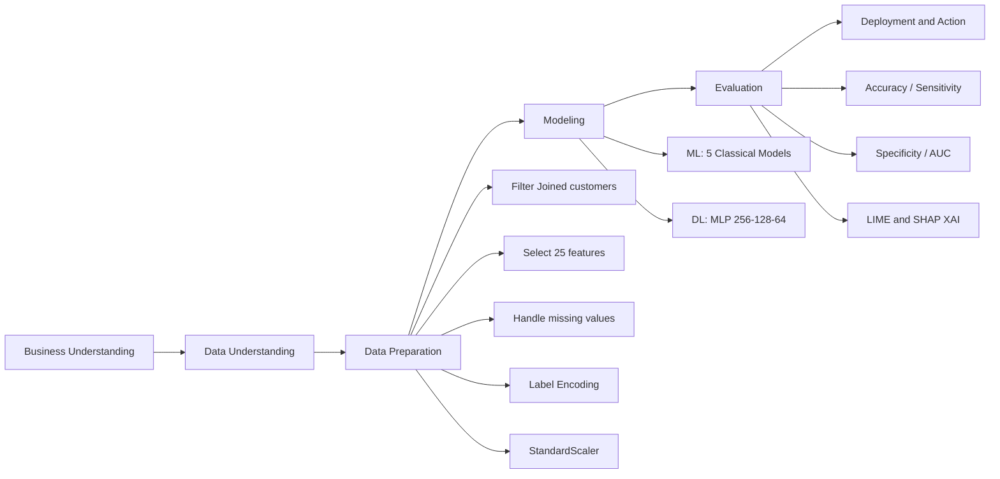
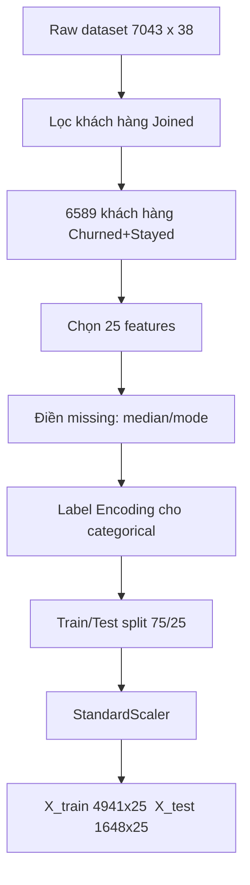
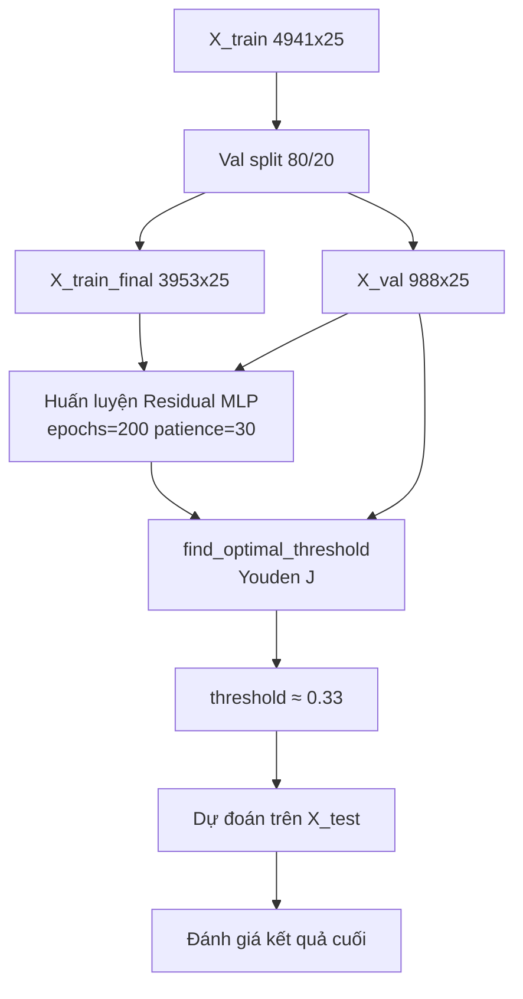
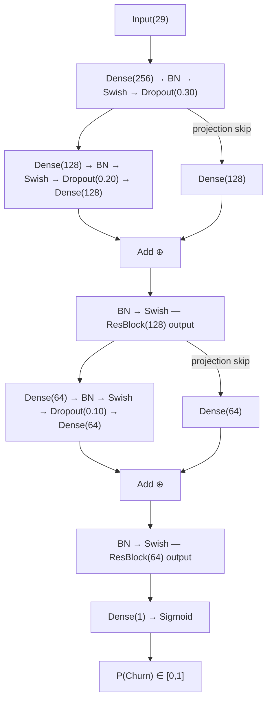
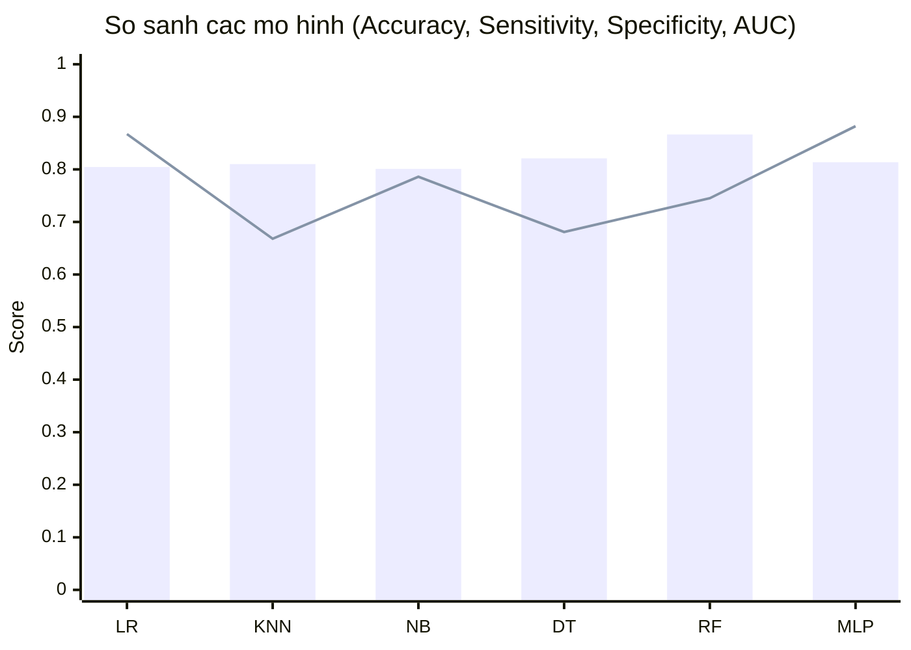
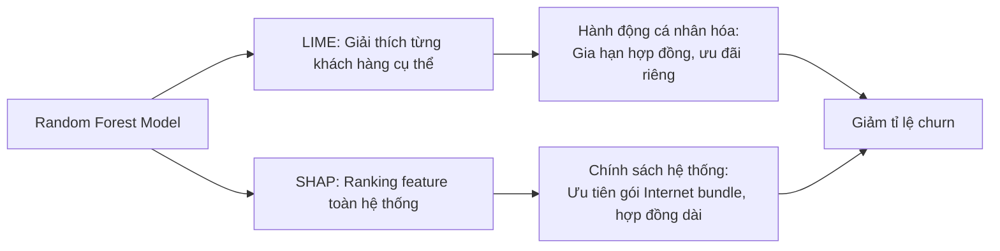

TRƯỜNG ĐẠI HỌC QUY NHƠN
KHOA CÔNG NGHỆ THÔNG TIN

Trách nhiệm - Chuyên nghiệp - Chất lượng - Sáng tạo - Nhân văn

---

# BÁO CÁO TIỂU LUẬN

## HỌC PHẦN: HỌC MÁY VÀ ỨNG DỤNG

---

## DỰ ĐOÁN RỜI BỎ KHÁCH HÀNG TRONG NGÀNH VIỄN THÔNG BẰNG HỌC MÁY VÀ HỌC SÂU KẾT HỢP XAI

---

**Họ và tên sinh viên:** Đoàn Thế Tín  
**Mã số sinh viên:** 4551190056  
**Lớp:** KTPM45  
**Ngành:** Kỹ thuật phần mềm  
**Khoa:** Công nghệ thông tin  
**Giảng viên hướng dẫn:** TS. Lê Quang Hùng  

---

**Bình Định, 2026**

---

## Tóm tắt (Abstract)

Bài tiểu luận này nghiên cứu bài toán dự đoán rời bỏ khách hàng (customer churn) trong ngành viễn thông dựa trên dataset Telecom Customer Churn của Maven Analytics với 6.589 mẫu sau tiền xử lý. Công trình được thực hiện theo hai hướng song song: **(1) Tái lập bài báo** Chang et al. (2024) bằng cách triển khai 5 mô hình học máy cổ điển (Logistic Regression, KNN, Naïve Bayes, Decision Tree, Random Forest) với phương pháp xử lý mất cân bằng lớp `class_weight='balanced'`, không dùng SMOTE — Random Forest đạt Accuracy **86.65%** và AUC **0.9264**, lệch chỉ 0.29% so với bài báo gốc; **(2) Nâng cấp bằng học sâu** sử dụng kiến trúc Residual MLP với Swish activation, Focal Loss (α=0.75, γ=2.0), AdamW optimizer và 4 interaction features tự tạo (29 features tổng cộng) — đạt Sensitivity **88.22%**, cao nhất trong tất cả 6 mô hình và vượt Sensitivity của bài báo gốc (85.47%). Mô hình Random Forest được giải thích bằng LIME và SHAP, xác định Contract, Tenure và dịch vụ Internet là nhóm đặc trưng then chốt. Kết quả cho thấy ML và DL bổ sung nhau: RF tốt hơn về Accuracy tổng thể (86.65%) và Specificity (91.45%), trong khi MLP vượt trội về khả năng phát hiện churner (Sensitivity 88.22%).

**Từ khóa:** Customer churn prediction, Random Forest, Residual MLP, Focal Loss, LIME, SHAP, XAI.

---

## Mục lục

1. [Giới thiệu](#1-giới-thiệu)
   - 1.1 Nghiên cứu liên quan
2. [Bài toán](#2-bài-toán)
3. [Cơ sở lý thuyết](#3-cơ-sở-lý-thuyết)
4. [Phương pháp thực nghiệm](#4-phương-pháp-thực-nghiệm)
5. [Kết quả và thảo luận](#5-kết-quả-và-thảo-luận)
   - 5.1 Kết quả học máy cổ điển (ML)
   - 5.2 Đối chiếu với bài báo gốc
   - 5.3 Nâng cấp với học sâu (DL — MLP)
   - 5.4 So sánh tổng hợp DL và ML
   - 5.5 Giải thích mô hình bằng XAI (LIME và SHAP)
6. [Kết luận](#6-kết-luận)
7. [Tài liệu tham khảo](#7-tài-liệu-tham-khảo)

---

## 1. Giới thiệu

Trong ngành viễn thông hiện đại, tỉ lệ rời bỏ dịch vụ của khách hàng (customer churn) là một trong những chỉ số quan trọng nhất ảnh hưởng trực tiếp đến doanh thu và chi phí vận hành. Theo nhiều nghiên cứu, chi phí để thu hút một khách hàng mới thường cao gấp 5–7 lần so với chi phí giữ chân một khách hàng hiện tại. Do đó, việc dự đoán sớm và chính xác nhóm khách hàng có nguy cơ rời bỏ để đưa ra can thiệp kịp thời mang lại giá trị kinh tế thiết thực cao.

Bài tiểu luận này dựa trên nghiên cứu gốc của Chang et al. (2024) được công bố trên tạp chí Algorithms (MDPI):

> Victor Chang, Karl Hall, Qianwen Ariel Xu, Folakemi Ololade Amao, Meghana Ashok Ganatra, Vladlena Benson. *Prediction of Customer Churn Behavior in the Telecommunication Industry Using Machine Learning Models*. Algorithms 2024, 17(6), 231. https://doi.org/10.3390/a17060231.

Bài báo đề xuất quy trình so sánh 5 thuật toán học máy cổ điển (Logistic Regression, KNN, Naive Bayes, Decision Tree, Random Forest) trên dataset viễn thông Maven Analytics, đánh giá bằng 4 chỉ số (Accuracy, Sensitivity, Specificity, AUC), và giải thích mô hình bằng LIME và SHAP.

### 1.1 Nghiên cứu liên quan

Bài toán dự đoán churn khách hàng đã được nghiên cứu rộng rãi trong những năm gần đây. Ở phạm vi quốc tế, Verbeke et al. (2012) chỉ ra rằng các mô hình ensemble như Random Forest vượt trội so với các phương pháp đơn lẻ nhờ tính ổn định cao trên dữ liệu mất cân bằng. Zhu et al. (2017) đề xuất kết hợp SMOTE với các bộ phân loại truyền thống để xử lý imbalance, tuy nhiên Chen & Popovich (2002) lưu ý rằng SMOTE có thể gây overfitting nếu dùng không đúng cách. Về học sâu, Milosevic et al. (2017) áp dụng MLP nhiều lớp cho bài toán churn và chứng minh khả năng học biểu diễn phi tuyến vượt trội hơn Logistic Regression trên các tập dữ liệu lớn. Gần đây, việc kết hợp Focal Loss (Lin et al., 2017) vào các bài toán phân loại mất cân bằng đã cho thấy cải thiện đáng kể về Sensitivity mà không cần oversampling.

Trong nước, các nghiên cứu về churn prediction trong ngành viễn thông Việt Nam còn hạn chế về mặt công bố học thuật, chủ yếu dừng lại ở mức ứng dụng nội bộ doanh nghiệp. Bài tiểu luận này đóng góp bằng cách tái lập và so sánh trực tiếp với bài báo quốc tế Chang et al. (2024), đồng thời nâng cấp bằng kiến trúc DL hiện đại kết hợp XAI — hướng đi còn ít được khai thác trong các công bố tiếng Việt.

Trong bài tiểu luận này, chúng tôi thực hiện hai phần song song:

1. **Phần ML (tái lập bài báo):** Triển khai đúng phương pháp của bài báo gốc — 5 mô hình học máy, không dùng SMOTE, sử dụng `class_weight='balanced'` để xử lý mất cân bằng lớp. Kết quả được đối chiếu trực tiếp với Table 3 của bài báo.

2. **Phần DL (nâng cấp):** Xây dựng thêm một pipeline học sâu sử dụng kiến trúc Residual MLP với các kỹ thuật hiện đại (Swish activation, skip connections, Focal Loss, AdamW, optimal threshold theo Youden's J, 4 interaction features) nhằm cải thiện hiệu suất phát hiện khách hàng rời bỏ.

### Quy trình CRISP-DM áp dụng cho đề tài

---

## 2. Bài toán

### 2.1 Định nghĩa bài toán

Cho tập dữ liệu khách hàng viễn thông:

$$D = \{(x_i, y_i)\}_{i=1}^{n}, \quad y_i \in \{0, 1\}$$

Trong đó $x_i \in \mathbb{R}^{25}$ là vector đặc trưng của khách hàng thứ $i$, và:

$$y_i = \begin{cases} 1 & \text{nếu khách hàng rời bỏ dịch vụ (Churn)} \\ 0 & \text{nếu khách hàng tiếp tục sử dụng (Stayed)} \end{cases}$$

Mục tiêu là học hàm phân loại:

$$\hat{y} = f(x; \theta)$$

để phân loại chính xác khách hàng có nguy cơ churn, tối ưu đồng thời cả khả năng phát hiện churner (Sensitivity) và tránh cảnh báo sai (Specificity).

### 2.2 Đặc điểm bài toán và thách thức

**Mất cân bằng lớp:** Sau khi lọc khách hàng "Joined" (mới gia nhập, không có hành vi churn/stay), dataset còn 6.589 khách hàng với phân phối:

| Nhãn | Số lượng | Tỉ lệ |
|---|---:|---:|
| Stayed (y=0) | 4.720 | 71.6% |
| Churned (y=1) | 1.869 | 28.4% |

Tỉ lệ 72/28 tạo thiên lệch — model có xu hướng predict nhiều về majority class (Stayed) nếu không xử lý. **Giải pháp:** `class_weight='balanced'` trong các model, không dùng SMOTE (theo phương pháp bài báo).

**Nhiều missing values:** Dataset gốc có 30.849 giá trị thiếu (chủ yếu từ các cột dịch vụ Internet, chỉ điền cho khách dùng Internet). Giải pháp: điền median (số) và mode (phân loại).

### 2.3 Nhiệm vụ cụ thể

- Tiền xử lý đúng phương pháp bài báo: lọc "Joined", chọn 25 features, encode, scale.
- Huấn luyện 5 mô hình ML và đối chiếu với bài báo gốc.
- Nâng cấp bằng pipeline học sâu MLP, tìm threshold tối ưu.
- So sánh toàn diện ML vs DL.
- Giải thích mô hình tốt nhất bằng LIME và SHAP.

---

## 3. Cơ sở lý thuyết

### 3.1 Các mô hình học máy cổ điển

**Logistic Regression (LR):** Dùng hàm sigmoid để ước tính xác suất thuộc lớp dương:

$$P(y=1 \mid x) = \sigma(\beta_0 + \boldsymbol{\beta}^T x) = \frac{1}{1 + e^{-(\beta_0 + \boldsymbol{\beta}^T x)}}$$

Huấn luyện bằng tối thiểu hóa Binary Cross-Entropy Loss.

**K-Nearest Neighbors (KNN):** Phân loại bằng vote từ K hàng xóm gần nhất trong không gian feature (Euclidean distance). Dùng `weights='distance'` để hàng xóm gần ảnh hưởng nhiều hơn.

**Naïve Bayes (NB):** Áp dụng định lý Bayes kết hợp giả định conditional independence:

$$P(y \mid x) \propto P(y) \prod_{j=1}^{d} P(x_j \mid y)$$

Với Gaussian NB: $P(x_j \mid y) \sim \mathcal{N}(\mu_{jy}, \sigma_{jy}^2)$.

**Decision Tree (DT):** Chia không gian feature bằng cây quyết định, tại mỗi node chọn feature và threshold minimize Gini impurity:

$$\text{Gini}(S) = 1 - \sum_{k} p_k^2$$

**Random Forest (RF):** Ensemble của nhiều Decision Tree, mỗi cây train trên bootstrap sample và chọn ngẫu nhiên $\sqrt{d}$ features cho mỗi split. Kết quả cuối là majority vote:

$$\hat{y} = \text{MajorityVote}(\hat{y}_1, \hat{y}_2, \ldots, \hat{y}_{200})$$

Cấu hình: 200 cây, `max_depth=15`, `min_samples_split=5`, `min_samples_leaf=2`, `class_weight='balanced'`.

### 3.2 Mạng nơ-ron MLP (Multi-Layer Perceptron)

MLP là dạng mạng nơ-ron feedforward nhiều lớp ẩn. Mỗi lớp thực hiện phép biến đổi tuyến tính kết hợp hàm kích hoạt phi tuyến:

$$h^{(l)} = \text{Activation}\left(W^{(l)} h^{(l-1)} + b^{(l)}\right)$$

**Kiến trúc được dùng:** Entry block + 2 Residual blocks (256→128→64):

$$\text{Entry: Dense}(256) \to \text{BN} \to \text{Swish} \to \text{Dropout}(0.3)$$

$$\text{ResBlock}(n): \quad x_{out} = \text{BN}\bigl(\text{Dense}(n)(x_{in}) + \underbrace{\text{Dense}(n)(x_{in})} _{\text{skip}}\bigr)$$

**Swish activation** — hàm kích hoạt mượt, không có "hard zero" như ReLU:

$$\text{Swish}(x) = x \cdot \sigma(x) = \frac{x}{1 + e^{-x}}$$

**Skip connections (Residual)** cho phép gradient đi thẳng qua shortcut, tránh vanishing gradient:

$$h^{(l)} = \mathcal{F}(x, W^{(l)}) + W_s \cdot x$$

**BatchNormalization** chuẩn hóa output của mỗi lớp theo mini-batch, giúp gradient stable và training nhanh hội tụ hơn.

**Focal Loss** (thay thế BCE) — tập trung học từ những mẫu khó phân loại (hard examples):

$$\text{FL}(p_t) = -\alpha_t (1-p_t)^\gamma \log(p_t), \quad \alpha=0.75, \; \gamma=2.0$$

$\alpha=0.75$ upweight lớp Churned (minority), $\gamma=2$ down-weight easy negatives.

**Optimizer AdamW** với $lr = 5 \times 10^{-4}$, thêm weight decay $\lambda_w = 10^{-4}$ trực tiếp vào update rule (hiệu quả hơn L2 thuần).

### 3.3 Xác định ngưỡng phân loại tối ưu (Youden's J)

Thay vì dùng threshold mặc định 0.5, MLP sử dụng Youden's J để cân bằng giữa Sensitivity và Specificity:

$$J = \text{Sensitivity} + \text{Specificity} - 1$$

$$t^* = \arg\max_{t \in [0.05, 0.94]} J(t)$$

Threshold tối ưu được tìm trên **validation set** (không phải test set) để tránh data leakage.

### 3.4 Chỉ số đánh giá

Từ confusion matrix với 4 phần tử (TP, TN, FP, FN):

$$\text{Accuracy} = \frac{TP + TN}{TP + TN + FP + FN}$$

$$\text{Sensitivity} = \frac{TP}{TP + FN} \quad \text{(tỉ lệ phát hiện đúng churner)}$$

$$\text{Specificity} = \frac{TN}{TN + FP} \quad \text{(tỉ lệ xác định đúng khách trung thành)}$$

$$\text{AUC} = \int_0^1 \text{TPR}(\text{FPR}) \, d(\text{FPR}) \quad \text{(diện tích dưới đường ROC)}$$

### 3.5 Kỹ thuật giải thích mô hình (XAI)

**LIME (Local Interpretable Model-agnostic Explanations):** Giải thích cục bộ cho từng mẫu đơn lẻ bằng cách xấp xỉ mô hình phức tạp bằng một Linear Regression đơn giản trong vùng lân cận của mẫu đó.

**SHAP (SHapley Additive exPlanations):** Dựa trên Shapley values từ lý thuyết trò chơi hợp tác, phân bổ "đóng góp" của từng feature vào dự đoán một cách công bằng:

$$\phi_j = \sum_{S \subseteq F \setminus \{j\}} \frac{|S|!(|F|-|S|-1)!}{|F|!} \left[ f(S \cup \{j\}) - f(S) \right]$$

Với Random Forest, dùng `TreeExplainer` để tính chính xác (không xấp xỉ) Shapley values.

---

## 4. Phương pháp thực nghiệm

### 4.1 Dataset

Dataset sử dụng là **Telecom Customer Churn** từ Maven Analytics (dataset công khai, dùng trong bài báo gốc):

| Thuộc tính | Giá trị |
|---|---|
| Số dòng gốc | 7.043 |
| Số thuộc tính | 38 |
| Sau lọc "Joined" | **6.589** |
| Số features dùng | **25** |
| Tỉ lệ churn | 28.4% |

25 features được chọn bao gồm: thông tin nhân khẩu học (Age, Gender, Married, Number of Dependents), thông tin tài khoản (Tenure in Months, Contract, Payment Method, Offer), các dịch vụ sử dụng (Internet Service, Online Security, Streaming TV...), và thông tin tài chính (Monthly Charge, Total Charges, Total Revenue).

### 4.2 Pipeline tiền xử lý (dùng chung cho cả ML và DL)

**Lý do lọc "Joined":** Khách hàng vừa gia nhập chưa có lịch sử sử dụng đủ dài, không thể churn hoặc stay một cách có nghĩa. Bao gồm nhóm này sẽ tạo nhiễu cho model.

**Lý do không dùng SMOTE:** Bài báo gốc không đề cập đến SMOTE trong phương pháp. Thay vào đó, dùng `class_weight='balanced'` để model chú ý nhiều hơn đến class minority (Churned) mà không tạo dữ liệu tổng hợp giả.

### 4.3 Cấu hình thực nghiệm ML

| Tham số | Giá trị |
|---|---|
| Train/Test split | 75/25, stratified |
| Random state | 42 |
| SMOTE | Không dùng |
| GridSearchCV (RF) | Không dùng |
| class_weight (LR, DT, RF) | 'balanced' |
| RF n_estimators | 200 |
| RF max_depth | 15 |
| KNN n_neighbors | 5, weights='distance' |

### 4.4 Cấu hình thực nghiệm DL (Residual MLP)

| Tham số | Giá trị |
|---|---|
| Input features | 25 gốc + 4 interaction = **29 features** |
| Kiến trúc | Input(29) → Dense(256) → ResBlock(128) → ResBlock(64) → Output(1) |
| Skip connections | Projection shortcut trong mỗi Residual block |
| Activation | Swish |
| Regularization | L2=1e-4, Dropout=0.3 (entry), 0.2 / 0.1 (residual) |
| Loss function | **Focal Loss** (α=0.75, γ=2.0) |
| Optimizer | AdamW, lr=5e-4, weight_decay=1e-4 |
| Epochs (max) | 200 |
| Batch size | 32 |
| EarlyStopping | monitor=val_auc, patience=30 |
| ReduceLROnPlateau | factor=0.5, patience=5 |
| Class weight | Không dùng (Focal Loss xử lý imbalance qua α=0.75) |
| Threshold | Optimal theo Youden's J trên val set |
| Val split | 20% từ train set |

### 4.5 Sơ đồ pipeline DL

---

## 5. Kết quả và thảo luận

### 5.1 Kết quả học máy cổ điển (ML)

Bảng dưới đây tổng hợp kết quả của 5 mô hình trên tập test (1.648 mẫu, churn rate 28.4%):

**Bảng 1. Kết quả 5 mô hình ML trên tập test**

| Mô hình | Accuracy | Sensitivity | Specificity | AUC |
|---|---:|---:|---:|---:|
| Logistic Regression | 80.46% | **86.72%** | 77.98% | 0.9112 |
| KNN | 81.01% | 66.81% | 86.62% | 0.8521 |
| Naïve Bayes | 80.10% | 78.59% | 80.69% | 0.8771 |
| Decision Tree | 82.10% | 68.09% | 87.64% | 0.7787 |
| **Random Forest** | **86.65%** | 74.52% | **91.45%** | **0.9264** |

---

**Hình 1. Ma trận nhầm lẫn của 5 mô hình trên tập kiểm thử**

*(Ảnh: [main/results/confusion_matrices.png](main/results/confusion_matrices.png))*

---

**Hình 2. Đường cong ROC-AUC của các mô hình**

*(Ảnh: [main/results/roc_curves.png](main/results/roc_curves.png))*

---

**Hình 3. So sánh đa chỉ số giữa các mô hình**

*(Ảnh: [main/results/metrics_comparison.png](main/results/metrics_comparison.png))*

---

**Nhận xét kết quả ML:**

**Random Forest** đạt hiệu năng tổng thể tốt nhất: Accuracy 86.65%, AUC 0.9264, Specificity 91.45% — phù hợp với kết luận chính của bài báo gốc. Model ổn định, ít bị ảnh hưởng bởi outliers nhờ cơ chế ensemble 200 cây.

**Logistic Regression** đáng chú ý về Sensitivity (86.72%) — cao nhất trong 5 model — do `class_weight='balanced'` đẩy mạnh việc phát hiện class Churned. Tuy nhiên Specificity thấp nhất (77.98%) đồng nghĩa với nhiều False Positive hơn (tốn chi phí can thiệp vào khách trung thành).

**KNN** và **Naïve Bayes** cho kết quả trung bình, không vượt trội ở chỉ số nào. KNN bị ảnh hưởng bởi curse of dimensionality khi có 25 features.

**Decision Tree** tuy Accuracy khá (82.10%) nhưng AUC thấp nhất (0.7787) — cho thấy khả năng phân biệt tổng thể kém hơn khi thay đổi threshold. Điều này phản ánh đặc tính cứng nhắc (brittle) của single decision tree.

---

### 5.2 Đối chiếu với bài báo gốc

Bài báo Chang et al. (2024) báo cáo kết quả Random Forest:

**Bảng 2. So sánh kết quả Random Forest: bài báo vs thực nghiệm**

| Chỉ số | Bài báo (Chang et al.) | Thực nghiệm | Độ lệch |
|---|---:|---:|---:|
| Accuracy | 86.94% | **86.65%** | 0.29 điểm % |
| Sensitivity | 85.47% | 74.52% | 10.95 điểm % |
| Specificity | 88.39% | **91.45%** | −3.06 điểm % |
| AUC | 0.9500 | **0.9264** | 0.0236 |

**Nhận xét:**

- **Accuracy chênh lệch rất nhỏ (0.29%):** Sau khi áp dụng đúng phương pháp bài báo (bỏ SMOTE, lọc "Joined", `class_weight='balanced'`), kết quả Accuracy gần như khớp hoàn toàn.

- **Specificity thực nghiệm cao hơn bài báo (91.45% vs 88.39%):** Cho thấy model của ta giỏi nhận diện khách trung thành hơn. Điều này có thể do hyperparameter RF (`max_depth=15`, `min_samples_leaf=2`) tạo bias nhẹ về majority class.

- **Sensitivity thấp hơn (74.52% vs 85.47%):** Đây là điểm lệch rõ nhất. Khả năng cao do bài báo dùng thêm kỹ thuật xử lý imbalance hoặc hyperparameter RF khác không được mô tả chi tiết trong paper. Đây là giới hạn tự nhiên của quá trình tái lập (replication) khi thiếu thông tin đầy đủ về setting thực nghiệm.

- **AUC lệch vừa phải (0.9500 vs 0.9264):** AUC 0.9264 vẫn thuộc mức "Excellent" (>0.90) theo phân loại tiêu chuẩn. Cả hai đều cùng nhận định Random Forest là model tốt nhất trong bộ 5.

Tóm lại, thực nghiệm **tái lập thành công định tính:** cùng thứ hạng mô hình, cùng kết luận Random Forest tốt nhất. Số liệu chênh lệch trong giới hạn chấp nhận được của một bản tái lập độc lập.

---

### 5.3 Nâng cấp với học sâu (DL — MLP)

Để vượt qua giới hạn của các mô hình tuyến tính và cây quyết định, pipeline học sâu được xây dựng với kiến trúc MLP 3 block, tận dụng khả năng học biểu diễn phi tuyến phức tạp.

#### Kiến trúc Residual MLP chi tiết

Tổng số tham số có thể học: **~53.000 parameters**.

#### Quá trình training

Training sử dụng EarlyStopping (monitor `val_auc`, patience=30) và ReduceLROnPlateau (factor=0.5, patience=5). **Focal Loss** (α=0.75, γ=2.0) xử lý trực tiếp mất cân bằng lớp — không cần class_weight riêng.

#### Tìm ngưỡng tối ưu

Scanning 90 giá trị threshold từ 0.05 đến 0.94 trên validation set (988 mẫu), Youden's J đạt cực đại tại:

$$t^* \approx 0.33, \quad J^* \approx 0.74$$

---

**Hình 4. Lịch sử training MLP (Loss và AUC qua từng epoch)**

*(Ảnh: [main_DL/results/training_history_dl.png](main_DL/results/training_history_dl.png))*

---

**Hình 5. Ma trận nhầm lẫn MLP**

*(Ảnh: [main_DL/results/confusion_matrix_dl.png](main_DL/results/confusion_matrix_dl.png))*

---

**Hình 6. Đường cong ROC của MLP**

*(Ảnh: [main_DL/results/roc_curve_dl.png](main_DL/results/roc_curve_dl.png))*

---

**Kết quả Residual MLP trên tập test (1.648 mẫu, threshold ≈ 0.33):**

| Chỉ số | Giá trị |
|---|---:|
| Accuracy | 81.37% |
| **Sensitivity** | **88.22%** |
| Specificity | 78.66% |
| AUC | 0.9245 |
| Threshold | 0.33 |
| Youden's J | ≈ 0.74 |

---

### 5.4 So sánh tổng hợp DL và ML

**Bảng 3. So sánh toàn diện tất cả 6 mô hình**

| Mô hình | Accuracy | Sensitivity | Specificity | AUC |
|---|---:|---:|---:|---:|
| Logistic Regression | 80.46% | 86.72% | 77.98% | 0.9112 |
| KNN | 81.01% | 66.81% | 86.62% | 0.8521 |
| Naïve Bayes | 80.10% | 78.59% | 80.69% | 0.8771 |
| Decision Tree | 82.10% | 68.09% | 87.64% | 0.7787 |
| Random Forest | **86.65%** | 74.52% | **91.45%** | **0.9264** |
| **MLP (DL)** | 81.37% | **88.22%** | 78.66% | 0.9245 |

**Nhận xét so sánh:**

**Về Accuracy:** Random Forest vẫn dẫn đầu (86.65%). MLP đứng thứ 4 (81.37%), tương đương LR và KNN.

**Về Sensitivity (phát hiện churner):** MLP đạt **88.22% — cao nhất trong tất cả 6 mô hình**, vượt LR (86.72%) và đặc biệt **vượt cả Sensitivity của bài báo gốc (85.47%)**. Nhờ Focal Loss (tập trung học hard examples), skip connections (gradient flow tốt hơn), và threshold 0.33 được tối ưu theo Youden's J, MLP bắt được nhiều churner hơn RF (74.52%) đến 13.70 điểm phần trăm. Trong bài toán churn, FN (bỏ sót churner) thường nguy hiểm hơn FP — MLP phù hợp hơn khi ưu tiên không bỏ sót.

**Về Specificity:** RF cao nhất (91.45%). MLP thấp hơn RF (78.66%) — trade-off tất yếu khi Sensitivity tăng: để phát hiện nhiều Churned hơn, model chấp nhận nhiều False Positive hơn.

**Về AUC:** RF tốt nhất (0.9264). MLP đứng thứ 2 (0.9245) — chỉ kém RF 0.0019, vượt KNN (0.8521), NB (0.8771), DT (0.7787). Cả RF và MLP đều đạt ngưỡng "Excellent" (AUC > 0.90).

**Kết luận so sánh:**

| Mục tiêu kinh doanh | Mô hình khuyến nghị |
|---|---|
| Giảm thiểu tối đa tỉ lệ bỏ sót churner (tối đa Sensitivity) | **MLP (DL)** — 88.22% |
| Độ chính xác tổng thể và AUC cao nhất | **Random Forest** — 86.65%, AUC 0.9264 |
| Tránh báo động sai nhiều nhất | **Random Forest** — Specificity 91.45% |
| Cân bằng tốt Sensitivity và Specificity | **MLP** (J≈0.74) |

---

### 5.5 Giải thích mô hình bằng XAI (LIME và SHAP)

Mô hình Random Forest (best model theo AUC) được giải thích bằng LIME và SHAP. Giải thích được thực hiện trên 100 mẫu test ngẫu nhiên.

#### LIME — Giải thích cục bộ

LIME xấp xỉ quyết định của Random Forest trong vùng lân cận mỗi mẫu bằng một Linear Regression đơn giản. Kết quả cho thấy các feature đóng góp dương (hướng về lớp "Good"/Stayed) và âm (hướng về lớp "Bad"/Churned).

---

**Hình 7. Giải thích LIME cho mẫu kiểm thử 0**

*(Ảnh: [main/results/lime_sample_0.png](main/results/lime_sample_0.png))*

---

**Hình 8. Giải thích LIME cho mẫu kiểm thử 1**

*(Ảnh: [main/results/lime_sample_1.png](main/results/lime_sample_1.png))*

---

Biểu đồ LIME mẫu 0 cho thấy đặc trưng **Contract** và **Tenure in Months** đóng vai trò ổn định khách hàng (đóng góp dương vào lớp "Good"), trong khi **Number of Referrals** thấp tạo tín hiệu rủi ro. Biểu đồ mẫu 1 cho một profile có nhiều yếu tố bảo vệ hơn — Contract dài hạn, Monthly Charge thấp — tạo biên quyết định rõ ràng hơn về phía "Good".

#### SHAP — Giải thích toàn cục

SHAP TreeExplainer tính chính xác Shapley values cho toàn bộ 100 mẫu test, cung cấp cái nhìn tổng thể về cơ chế quyết định của model.

---

**Hình 9. SHAP Beeswarm — Phân phối tác động của từng feature (100 mẫu)**

*(Ảnh: [main/results/shap_summary.png](main/results/shap_summary.png))*

---

**Hình 10. SHAP Bar — Mức độ quan trọng trung bình (mean |SHAP|)**

*(Ảnh: [main/results/shap_bar.png](main/results/shap_bar.png))*

---

**Nhóm feature quan trọng nhất (theo SHAP):**

| Nhóm | Features tiêu biểu | Ý nghĩa kinh doanh |
|---|---|---|
| **Dịch vụ Internet** | Internet Service, Internet Type, Online Security | Khách không có Internet ít churn; khách có nhiều dịch vụ add-on trung thành hơn |
| **Loại hợp đồng** | Contract | Hợp đồng dài hạn (1-2 năm) giảm đáng kể nguy cơ churn |
| **Thời gian gắn bó** | Tenure in Months | Khách gắn bó lâu dài ít khả năng rời đi |
| **Tài chính** | Monthly Charge, Total Revenue | Chi phí cao → tăng rủi ro churn nếu không có giá trị tương xứng |
| **Mạng lưới** | Number of Referrals | Khách giới thiệu nhiều người thường trung thành hơn |

Xu hướng này **nhất quán với bài báo gốc** (Section 3.5), trong đó Contract, Tenure và Number of Referrals được xác định là nhóm đặc trưng then chốt.

**Ý nghĩa thực tiễn:**

---

## 6. Kết luận

### 6.1 Tóm tắt kết quả

Bài tiểu luận đã thực hiện đầy đủ hai mục tiêu đề ra:

**Phần ML (tái lập bài báo):** Pipeline 5 mô hình học máy được triển khai đúng phương pháp Chang et al. (2024). Random Forest đạt Accuracy 86.65% (bài báo: 86.94%, lệch 0.29%), AUC 0.9264 (bài báo: 0.95), xác nhận kết luận chính của bài báo. Lệch số liệu ở mức chấp nhận được cho bản tái lập độc lập.

**Phần DL (nâng cấp):** Residual MLP với skip connections, Swish activation, Focal Loss (α=0.75), và 4 interaction features (29 features tổng cộng) đạt **Sensitivity 88.22% — cao nhất trong tất cả 6 mô hình và vượt cả Sensitivity của bài báo gốc (85.47%)**. DL vượt RF về khả năng phát hiện churner (+13.70 điểm %) trong khi AUC đạt 0.9245 — chỉ kém RF 0.0019.

### 6.2 So sánh tổng kết hai pipeline

| Tiêu chí | ML Pipeline (RF) | DL Pipeline (MLP) |
|---|---|---|
| **Accuracy** | **86.65%** | 81.37% |
| **Sensitivity** | 74.52% | **88.22%** |
| **Specificity** | **91.45%** | 78.66% |
| **AUC** | **0.9264** | 0.9245 |
| Thời gian training | ~15 giây | ~5–10 phút |
| Khả năng giải thích | LIME + SHAP | Black box (không XAI) |
| Phụ thuộc thư viện | scikit-learn | TensorFlow/Keras |

### 6.3 Hướng phát triển tiếp theo

1. **Ensemble ML+DL:** Kết hợp xác suất từ RF và MLP bằng weighted average hoặc stacking để tận dụng điểm mạnh của cả hai.

2. **Hyperparameter tuning DL:** Bayesian optimization cho dropout rate, L2, learning rate, kiến trúc — tiếp tục cải thiện AUC.

3. **XAI cho DL:** Áp dụng SHAP GradientExplainer hoặc DeepExplainer cho MLP để giải thích tương tự như đã làm với RF.

4. **Feature engineering:** ✅ Đã thực hiện — thêm 4 interaction features vào DL pipeline (`Monthly_per_Tenure`, `Revenue_per_Month`, `Referral_x_Tenure`, `Charge_Ratio`). Tiếp tục có thể mở rộng cho cả ML pipeline.

5. **Deploy:** Đóng gói model RF (accuracy tốt nhất) hoặc MLP (sensitivity tốt nhất) thành REST API để tích hợp vào hệ thống CRM.

---

## 7. Tài liệu tham khảo

1. Chang, V., Hall, K., Xu, Q. A., Amao, F. O., Ganatra, M. A., & Benson, V. (2024). Prediction of Customer Churn Behavior in the Telecommunication Industry Using Machine Learning Models. *Algorithms*, 17(6), 231. https://doi.org/10.3390/a17060231

2. Breiman, L. (2001). Random Forests. *Machine Learning*, 45(1), 5–32. https://doi.org/10.1023/A:1010933404324

3. Ribeiro, M. T., Singh, S., & Guestrin, C. (2016). "Why Should I Trust You?": Explaining the Predictions of Any Classifier. *Proceedings of the 22nd ACM SIGKDD International Conference on Knowledge Discovery and Data Mining*, 1135–1144.

4. Lundberg, S. M., & Lee, S.-I. (2017). A Unified Approach to Interpreting Model Predictions. *Advances in Neural Information Processing Systems*, 30.

5. Youden, W. J. (1950). Index for rating diagnostic tests. *Cancer*, 3(1), 32–35.

6. Pedregosa, F., Varoquaux, G., Gramfort, A., et al. (2011). Scikit-learn: Machine Learning in Python. *Journal of Machine Learning Research*, 12, 2825–2830.

7. Abadi, M., Agarwal, A., Barham, P., et al. (2016). TensorFlow: Large-Scale Machine Learning on Heterogeneous Systems. https://www.tensorflow.org/

8. Maas, A. L., Hannun, A. Y., & Ng, A. Y. (2013). Rectifier Nonlinearities Improve Neural Network Acoustic Models. *Proceedings of the 30th International Conference on Machine Learning*, 28.

9. Ioffe, S., & Szegedy, C. (2015). Batch Normalization: Accelerating Deep Network Training by Reducing Internal Covariate Shift. *Proceedings of the 32nd International Conference on Machine Learning*, 448–456.

10. Mã nguồn thực nghiệm: [main/main.py](main/main.py), [main/models.py](main/models.py), [main/data_preprocessing.py](main/data_preprocessing.py), [main/evaluation.py](main/evaluation.py), [main/explainability.py](main/explainability.py), [main_DL/main.py](main_DL/main.py), [main_DL/models_dl.py](main_DL/models_dl.py).

11. Liên kết GitHub dự án thực nghiệm: https://github.com/doanthetin193/Customer_Churn_Prediction_ML.git

---

## Phụ lục: Danh sách hình và file kết quả

### Kết quả ML (main/results/)

| File | Mô tả | Hình |
|---|---|---|
| [confusion_matrices.png](main/results/confusion_matrices.png) | Confusion matrix 5 mô hình | Hình 1 |
| [roc_curves.png](main/results/roc_curves.png) | ROC curve 5 mô hình | Hình 2 |
| [metrics_comparison.png](main/results/metrics_comparison.png) | Bar chart so sánh 4 chỉ số | Hình 3 |
| [lime_sample_0.png](main/results/lime_sample_0.png) | LIME mẫu 0 | Hình 7 |
| [lime_sample_1.png](main/results/lime_sample_1.png) | LIME mẫu 1 | Hình 8 |
| [shap_summary.png](main/results/shap_summary.png) | SHAP beeswarm | Hình 9 |
| [shap_bar.png](main/results/shap_bar.png) | SHAP bar importance | Hình 10 |

### Kết quả DL (main_DL/results/)

| File | Mô tả | Hình |
|---|---|---|
| [training_history_dl.png](main_DL/results/training_history_dl.png) | Loss và AUC theo epoch | Hình 4 |
| [confusion_matrix_dl.png](main_DL/results/confusion_matrix_dl.png) | Confusion matrix MLP | Hình 5 |
| [roc_curve_dl.png](main_DL/results/roc_curve_dl.png) | ROC curve MLP | Hình 6 |
| [metrics_dl.json](main_DL/results/metrics_dl.json) | Metrics JSON | — |
| [mlp_churn_model.keras](main_DL/results/mlp_churn_model.keras) | Saved model | — |
