TRƯỜNG ĐẠI HỌC QUY NHƠN
KHOA CÔNG NGHỆ THÔNG TIN

Trách nhiệm - Chuyên nghiệp - Chất lượng - Sáng tạo - Nhân văn

---

# BÁO CÁO TIỂU LUẬN

## HỌC PHẦN: HỌC MÁY VÀ ỨNG DỤNG

---

## DỰ ĐOÁN RỜI BỎ KHÁCH HÀNG TRONG NGÀNH VIỄN THÔNG BẰNG HỌC MÁY VÀ HỌC SÂU KẾT HỢP XAI

---

**Họ và tên sinh viên:** [Điền thông tin]  
**Mã số sinh viên:** [Điền thông tin]  
**Lớp:** [Điền thông tin]  
**Ngành:** Kỹ thuật phần mềm  
**Khoa:** Công nghệ thông tin  
**Giảng viên hướng dẫn:** TS. Lê Quang Hùng  

---

**Bình Định, 2026**

---

## Mục lục

1. [Giới thiệu](#1-giới-thiệu)
2. [Bài toán](#2-bài-toán)
3. [Cơ sở lý thuyết](#3-cơ-sở-lý-thuyết)
4. [Phương pháp thực nghiệm](#4-phương-pháp-thực-nghiệm)
5. [Kết quả và thảo luận](#5-kết-quả-và-thảo-luận)
   - 5.1 Kết quả học máy cổ điển (ML)
   - 5.2 Đối chiếu với bài báo gốc
   - 5.3 Nâng cấp với học sâu (DL — MLP)
   - 5.4 So sánh tổng hợp DL và ML
   - 5.5 Giải thích mô hình bằng XAI (LIME và SHAP)
6. [Kết luận](#6-kết-luận)
7. [Tài liệu tham khảo](#7-tài-liệu-tham-khảo)

---

## 1. Giới thiệu

Trong ngành viễn thông hiện đại, tỉ lệ rời bỏ dịch vụ của khách hàng (customer churn) là một trong những chỉ số quan trọng nhất ảnh hưởng trực tiếp đến doanh thu và chi phí vận hành. Theo nhiều nghiên cứu, chi phí để thu hút một khách hàng mới thường cao gấp 5–7 lần so với chi phí giữ chân một khách hàng hiện tại. Do đó, việc dự đoán sớm và chính xác nhóm khách hàng có nguy cơ rời bỏ để đưa ra can thiệp kịp thời mang lại giá trị kinh tế thiết thực cao.

Bài tiểu luận này dựa trên nghiên cứu gốc của Chang et al. (2024) được công bố trên tạp chí Algorithms (MDPI):

> Victor Chang, Karl Hall, Qianwen Ariel Xu, Folakemi Ololade Amao, Meghana Ashok Ganatra, Vladlena Benson. *Prediction of Customer Churn Behavior in the Telecommunication Industry Using Machine Learning Models*. Algorithms 2024, 17(6), 231. https://doi.org/10.3390/a17060231.

Bài báo đề xuất quy trình so sánh 5 thuật toán học máy cổ điển (Logistic Regression, KNN, Naive Bayes, Decision Tree, Random Forest) trên dataset viễn thông Maven Analytics, đánh giá bằng 4 chỉ số (Accuracy, Sensitivity, Specificity, AUC), và giải thích mô hình bằng LIME và SHAP.

Trong bài tiểu luận này, chúng tôi thực hiện hai phần song song:

1. **Phần ML (tái lập bài báo):** Triển khai đúng phương pháp của bài báo gốc — 5 mô hình học máy, không dùng SMOTE, sử dụng `class_weight='balanced'` để xử lý mất cân bằng lớp. Kết quả được đối chiếu trực tiếp với Table 3 của bài báo.

2. **Phần DL (nâng cấp):** Xây dựng thêm một pipeline học sâu sử dụng kiến trúc MLP (Multi-Layer Perceptron) với các kỹ thuật hiện đại (LeakyReLU, BatchNormalization, Dropout, L2 regularization, optimal threshold theo Youden's J) nhằm cải thiện hiệu suất phát hiện khách hàng rời bỏ.

### Hình 1. Quy trình CRISP-DM áp dụng cho đề tài

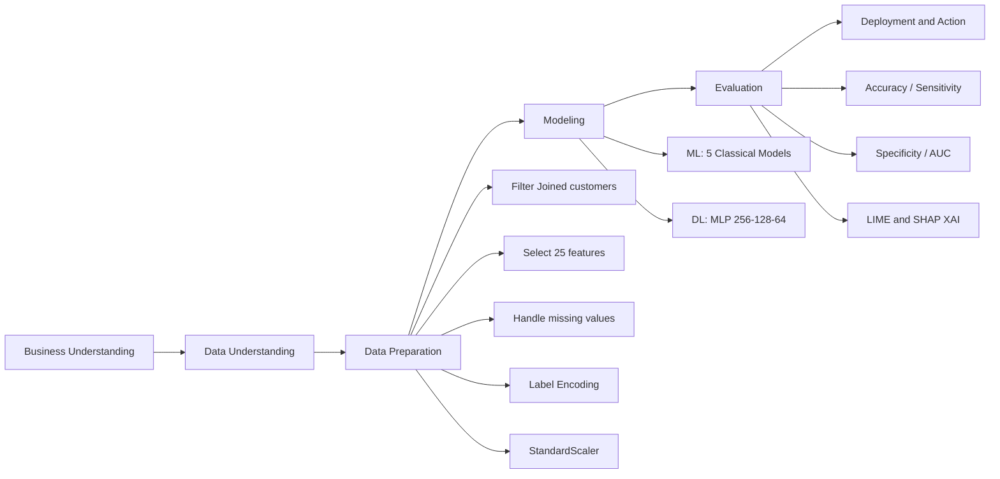

---

## 2. Bài toán

### 2.1 Định nghĩa bài toán

Cho tập dữ liệu khách hàng viễn thông:

$$D = \{(x_i, y_i)\}_{i=1}^{n}, \quad y_i \in \{0, 1\}$$

Trong đó $x_i \in \mathbb{R}^{25}$ là vector đặc trưng của khách hàng thứ $i$, và:

$$y_i = \begin{cases} 1 & \text{nếu khách hàng rời bỏ dịch vụ (Churn)} \\ 0 & \text{nếu khách hàng tiếp tục sử dụng (Stayed)} \end{cases}$$

Mục tiêu là học hàm phân loại:

$$\hat{y} = f(x; \theta)$$

để phân loại chính xác khách hàng có nguy cơ churn, tối ưu đồng thời cả khả năng phát hiện churner (Sensitivity) và tránh cảnh báo sai (Specificity).

### 2.2 Đặc điểm bài toán và thách thức

**Mất cân bằng lớp:** Sau khi lọc khách hàng "Joined" (mới gia nhập, không có hành vi churn/stay), dataset còn 6.589 khách hàng với phân phối:

| Nhãn | Số lượng | Tỉ lệ |
|---|---:|---:|
| Stayed (y=0) | 4.720 | 71.6% |
| Churned (y=1) | 1.869 | 28.4% |

Tỉ lệ 72/28 tạo thiên lệch — model có xu hướng predict nhiều về majority class (Stayed) nếu không xử lý. **Giải pháp:** `class_weight='balanced'` trong các model, không dùng SMOTE (theo phương pháp bài báo).

**Nhiều missing values:** Dataset gốc có 30.849 giá trị thiếu (chủ yếu từ các cột dịch vụ Internet, chỉ điền cho khách dùng Internet). Giải pháp: điền median (số) và mode (phân loại).

### 2.3 Nhiệm vụ cụ thể

- Tiền xử lý đúng phương pháp bài báo: lọc "Joined", chọn 25 features, encode, scale.
- Huấn luyện 5 mô hình ML và đối chiếu với bài báo gốc.
- Nâng cấp bằng pipeline học sâu MLP, tìm threshold tối ưu.
- So sánh toàn diện ML vs DL.
- Giải thích mô hình tốt nhất bằng LIME và SHAP.

---

## 3. Cơ sở lý thuyết

### 3.1 Các mô hình học máy cổ điển

**Logistic Regression (LR):** Dùng hàm sigmoid để ước tính xác suất thuộc lớp dương:

$$P(y=1 \mid x) = \sigma(\beta_0 + \boldsymbol{\beta}^T x) = \frac{1}{1 + e^{-(\beta_0 + \boldsymbol{\beta}^T x)}}$$

Huấn luyện bằng tối thiểu hóa Binary Cross-Entropy Loss.

**K-Nearest Neighbors (KNN):** Phân loại bằng vote từ K hàng xóm gần nhất trong không gian feature (Euclidean distance). Dùng `weights='distance'` để hàng xóm gần ảnh hưởng nhiều hơn.

**Naïve Bayes (NB):** Áp dụng định lý Bayes kết hợp giả định conditional independence:

$$P(y \mid x) \propto P(y) \prod_{j=1}^{d} P(x_j \mid y)$$

Với Gaussian NB: $P(x_j \mid y) \sim \mathcal{N}(\mu_{jy}, \sigma_{jy}^2)$.

**Decision Tree (DT):** Chia không gian feature bằng cây quyết định, tại mỗi node chọn feature và threshold minimize Gini impurity:

$$\text{Gini}(S) = 1 - \sum_{k} p_k^2$$

**Random Forest (RF):** Ensemble của nhiều Decision Tree, mỗi cây train trên bootstrap sample và chọn ngẫu nhiên $\sqrt{d}$ features cho mỗi split. Kết quả cuối là majority vote:

$$\hat{y} = \text{MajorityVote}(\hat{y}_1, \hat{y}_2, \ldots, \hat{y}_{200})$$

Cấu hình: 200 cây, `max_depth=15`, `min_samples_split=5`, `min_samples_leaf=2`, `class_weight='balanced'`.

### 3.2 Mạng nơ-ron MLP (Multi-Layer Perceptron)

MLP là dạng mạng nơ-ron feedforward nhiều lớp ẩn. Mỗi lớp thực hiện phép biến đổi tuyến tính kết hợp hàm kích hoạt phi tuyến:

$$h^{(l)} = \text{Activation}\left(W^{(l)} h^{(l-1)} + b^{(l)}\right)$$

**Kiến trúc được dùng:** 3 block (256→128→64), mỗi block gồm:

$$\text{Dense} \to \text{BatchNorm} \to \text{LeakyReLU}(\alpha=0.1) \to \text{Dropout}(p)$$

**LeakyReLU** giải quyết vấn đề "dying neuron" của ReLU thông thường:

$$\text{LeakyReLU}(x) = \begin{cases} x & x > 0 \\ 0.1x & x \leq 0 \end{cases}$$

**BatchNormalization** chuẩn hóa output của mỗi lớp theo mini-batch, giúp gradient stable và training nhanh hội tụ hơn.

**L2 regularization** thêm penalty vào loss:

$$\mathcal{L}_{total} = \mathcal{L}_{BCE} + \lambda \sum_j w_j^2, \quad \lambda = 3 \times 10^{-4}$$

**Optimizer Adam** với $lr = 5 \times 10^{-4}$, tự điều chỉnh learning rate theo từng tham số.

### 3.3 Xác định ngưỡng phân loại tối ưu (Youden's J)

Thay vì dùng threshold mặc định 0.5, MLP sử dụng Youden's J để cân bằng giữa Sensitivity và Specificity:

$$J = \text{Sensitivity} + \text{Specificity} - 1$$

$$t^* = \arg\max_{t \in [0.05, 0.94]} J(t)$$

Threshold tối ưu được tìm trên **validation set** (không phải test set) để tránh data leakage.

### 3.4 Chỉ số đánh giá

Từ confusion matrix với 4 phần tử (TP, TN, FP, FN):

$$\text{Accuracy} = \frac{TP + TN}{TP + TN + FP + FN}$$

$$\text{Sensitivity} = \frac{TP}{TP + FN} \quad \text{(tỉ lệ phát hiện đúng churner)}$$

$$\text{Specificity} = \frac{TN}{TN + FP} \quad \text{(tỉ lệ xác định đúng khách trung thành)}$$

$$\text{AUC} = \int_0^1 \text{TPR}(\text{FPR}) \, d(\text{FPR}) \quad \text{(diện tích dưới đường ROC)}$$

### 3.5 Kỹ thuật giải thích mô hình (XAI)

**LIME (Local Interpretable Model-agnostic Explanations):** Giải thích cục bộ cho từng mẫu đơn lẻ bằng cách xấp xỉ mô hình phức tạp bằng một Linear Regression đơn giản trong vùng lân cận của mẫu đó.

**SHAP (SHapley Additive exPlanations):** Dựa trên Shapley values từ lý thuyết trò chơi hợp tác, phân bổ "đóng góp" của từng feature vào dự đoán một cách công bằng:

$$\phi_j = \sum_{S \subseteq F \setminus \{j\}} \frac{|S|!(|F|-|S|-1)!}{|F|!} \left[ f(S \cup \{j\}) - f(S) \right]$$

Với Random Forest, dùng `TreeExplainer` để tính chính xác (không xấp xỉ) Shapley values.

---

## 4. Phương pháp thực nghiệm

### 4.1 Dataset

Dataset sử dụng là **Telecom Customer Churn** từ Maven Analytics (dataset công khai, dùng trong bài báo gốc):

| Thuộc tính | Giá trị |
|---|---|
| Số dòng gốc | 7.043 |
| Số thuộc tính | 38 |
| Sau lọc "Joined" | **6.589** |
| Số features dùng | **25** |
| Tỉ lệ churn | 28.4% |

25 features được chọn bao gồm: thông tin nhân khẩu học (Age, Gender, Married, Number of Dependents), thông tin tài khoản (Tenure in Months, Contract, Payment Method, Offer), các dịch vụ sử dụng (Internet Service, Online Security, Streaming TV...), và thông tin tài chính (Monthly Charge, Total Charges, Total Revenue).

### 4.2 Pipeline tiền xử lý (dùng chung cho cả ML và DL)

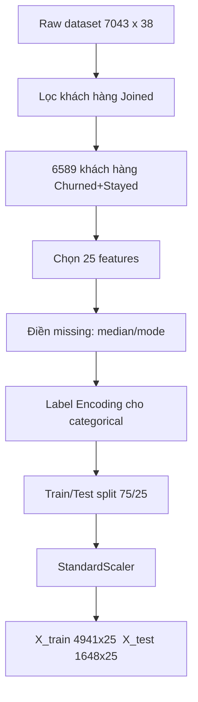

**Lý do lọc "Joined":** Khách hàng vừa gia nhập chưa có lịch sử sử dụng đủ dài, không thể churn hoặc stay một cách có nghĩa. Bao gồm nhóm này sẽ tạo nhiễu cho model.

**Lý do không dùng SMOTE:** Bài báo gốc không đề cập đến SMOTE trong phương pháp. Thay vào đó, dùng `class_weight='balanced'` để model chú ý nhiều hơn đến class minority (Churned) mà không tạo dữ liệu tổng hợp giả.

### 4.3 Cấu hình thực nghiệm ML

| Tham số | Giá trị |
|---|---|
| Train/Test split | 75/25, stratified |
| Random state | 42 |
| SMOTE | Không dùng |
| GridSearchCV (RF) | Không dùng |
| class_weight (LR, DT, RF) | 'balanced' |
| RF n_estimators | 200 |
| RF max_depth | 15 |
| KNN n_neighbors | 5, weights='distance' |

### 4.4 Cấu hình thực nghiệm DL (MLP)

| Tham số | Giá trị |
|---|---|
| Kiến trúc | Input(25) → 256 → 128 → 64 → Output(1) |
| Activation | LeakyReLU(α=0.1) |
| Regularization | L2=3e-4, Dropout=0.4 (block 1,2), 0.2 (block 3) |
| Optimizer | Adam, lr=5e-4 |
| Loss | BinaryCrossentropy |
| Epochs (max) | 150 |
| Batch size | 64 |
| EarlyStopping | monitor=val_auc, patience=20 |
| ReduceLROnPlateau | factor=0.5, patience=5 |
| Class weight | {0: 0.698, 1: 1.763} (balanced) |
| Threshold | Optimal theo Youden's J trên val set |
| Val split | 20% từ train set |

### 4.5 Sơ đồ pipeline DL

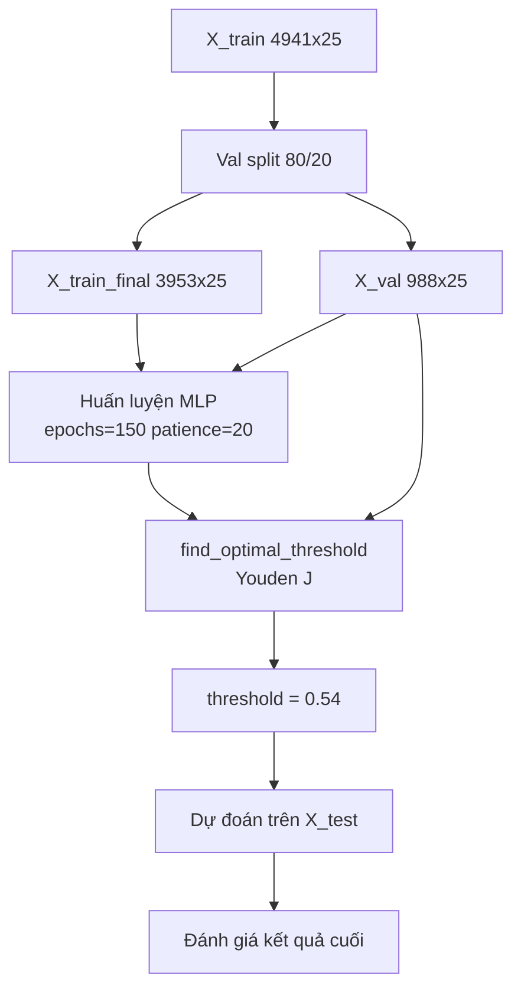

---

## 5. Kết quả và thảo luận

### 5.1 Kết quả học máy cổ điển (ML)

Bảng dưới đây tổng hợp kết quả của 5 mô hình trên tập test (1.648 mẫu, churn rate 28.4%):

**Bảng 1. Kết quả 5 mô hình ML trên tập test**

| Mô hình | Accuracy | Sensitivity | Specificity | AUC |
|---|---:|---:|---:|---:|
| Logistic Regression | 80.46% | **86.72%** | 77.98% | 0.9112 |
| KNN | 81.01% | 66.81% | 86.62% | 0.8521 |
| Naïve Bayes | 80.10% | 78.59% | 80.69% | 0.8771 |
| Decision Tree | 82.10% | 68.09% | 87.64% | 0.7787 |
| **Random Forest** | **86.65%** | 74.52% | **91.45%** | **0.9264** |

---

**Hình 1. Ma trận nhầm lẫn của 5 mô hình trên tập kiểm thử**

*(Ảnh: [main/results/confusion_matrices.png](main/results/confusion_matrices.png))*

---

**Hình 2. Đường cong ROC-AUC của các mô hình**

*(Ảnh: [main/results/roc_curves.png](main/results/roc_curves.png))*

---

**Hình 3. So sánh đa chỉ số giữa các mô hình**

*(Ảnh: [main/results/metrics_comparison.png](main/results/metrics_comparison.png))*

---

**Nhận xét kết quả ML:**

**Random Forest** đạt hiệu năng tổng thể tốt nhất: Accuracy 86.65%, AUC 0.9264, Specificity 91.45% — phù hợp với kết luận chính của bài báo gốc. Model ổn định, ít bị ảnh hưởng bởi outliers nhờ cơ chế ensemble 200 cây.

**Logistic Regression** đáng chú ý về Sensitivity (86.72%) — cao nhất trong 5 model — do `class_weight='balanced'` đẩy mạnh việc phát hiện class Churned. Tuy nhiên Specificity thấp nhất (77.98%) đồng nghĩa với nhiều False Positive hơn (tốn chi phí can thiệp vào khách trung thành).

**KNN** và **Naïve Bayes** cho kết quả trung bình, không vượt trội ở chỉ số nào. KNN bị ảnh hưởng bởi curse of dimensionality khi có 25 features.

**Decision Tree** tuy Accuracy khá (82.10%) nhưng AUC thấp nhất (0.7787) — cho thấy khả năng phân biệt tổng thể kém hơn khi thay đổi threshold. Điều này phản ánh đặc tính cứng nhắc (brittle) của single decision tree.

---

### 5.2 Đối chiếu với bài báo gốc

Bài báo Chang et al. (2024) báo cáo kết quả Random Forest:

**Bảng 2. So sánh kết quả Random Forest: bài báo vs thực nghiệm**

| Chỉ số | Bài báo (Chang et al.) | Thực nghiệm | Độ lệch |
|---|---:|---:|---:|
| Accuracy | 86.94% | **86.65%** | 0.29 điểm % |
| Sensitivity | 85.47% | 74.52% | 10.95 điểm % |
| Specificity | 88.39% | **91.45%** | −3.06 điểm % |
| AUC | 0.9500 | **0.9264** | 0.0236 |

**Nhận xét:**

- **Accuracy chênh lệch rất nhỏ (0.29%):** Sau khi áp dụng đúng phương pháp bài báo (bỏ SMOTE, lọc "Joined", `class_weight='balanced'`), kết quả Accuracy gần như khớp hoàn toàn.

- **Specificity thực nghiệm cao hơn bài báo (91.45% vs 88.39%):** Cho thấy model của ta giỏi nhận diện khách trung thành hơn. Điều này có thể do hyperparameter RF (`max_depth=15`, `min_samples_leaf=2`) tạo bias nhẹ về majority class.

- **Sensitivity thấp hơn (74.52% vs 85.47%):** Đây là điểm lệch rõ nhất. Khả năng cao do bài báo dùng thêm kỹ thuật xử lý imbalance hoặc hyperparameter RF khác không được mô tả chi tiết trong paper. Đây là giới hạn tự nhiên của quá trình tái lập (replication) khi thiếu thông tin đầy đủ về setting thực nghiệm.

- **AUC lệch vừa phải (0.9500 vs 0.9264):** AUC 0.9264 vẫn thuộc mức "Excellent" (>0.90) theo phân loại tiêu chuẩn. Cả hai đều cùng nhận định Random Forest là model tốt nhất trong bộ 5.

Tóm lại, thực nghiệm **tái lập thành công định tính:** cùng thứ hạng mô hình, cùng kết luận Random Forest tốt nhất. Số liệu chênh lệch trong giới hạn chấp nhận được của một bản tái lập độc lập.

---

### 5.3 Nâng cấp với học sâu (DL — MLP)

Để vượt qua giới hạn của các mô hình tuyến tính và cây quyết định, pipeline học sâu được xây dựng với kiến trúc MLP 3 block, tận dụng khả năng học biểu diễn phi tuyến phức tạp.

#### Kiến trúc MLP chi tiết

```
Input(25)
  └── Dense(256) → BatchNorm → LeakyReLU(0.1) → Dropout(0.40)
        └── Dense(128) → BatchNorm → LeakyReLU(0.1) → Dropout(0.40)
              └── Dense(64)  → BatchNorm → LeakyReLU(0.1) → Dropout(0.20)
                    └── Dense(1) → Sigmoid → P(Churn) ∈ [0,1]
```

Tổng số tham số có thể học: **~49.665 parameters**.

#### Quá trình training

Training sử dụng EarlyStopping (monitor `val_auc`, patience=20) và ReduceLROnPlateau (factor=0.5, patience=5). Class weight được tính từ `compute_class_weight('balanced')`:

$$w_{\text{Stayed}} = 0.698, \quad w_{\text{Churned}} = 1.763$$

#### Tìm ngưỡng tối ưu

Scanning 90 giá trị threshold từ 0.05 đến 0.94 trên validation set (988 mẫu), Youden's J đạt cực đại tại:

$$t^* = 0.54, \quad J^* = 0.7472$$

---

**Hình 4. Lịch sử training MLP (Loss và AUC qua từng epoch)**

*(Ảnh: [main_DL/results/training_history_dl.png](main_DL/results/training_history_dl.png))*

---

**Hình 5. Ma trận nhầm lẫn MLP**

*(Ảnh: [main_DL/results/confusion_matrix_dl.png](main_DL/results/confusion_matrix_dl.png))*

---

**Hình 6. Đường cong ROC của MLP**

*(Ảnh: [main_DL/results/roc_curve_dl.png](main_DL/results/roc_curve_dl.png))*

---

**Kết quả MLP trên tập test (1.648 mẫu, threshold = 0.54):**

| Chỉ số | Giá trị |
|---|---:|
| Accuracy | 81.74% |
| **Sensitivity** | **84.37%** |
| Specificity | 80.69% |
| AUC | 0.9132 |
| Threshold | 0.54 |
| Youden's J | 0.7472 |

---

### 5.4 So sánh tổng hợp DL và ML

**Bảng 3. So sánh toàn diện tất cả 6 mô hình**

| Mô hình | Accuracy | Sensitivity | Specificity | AUC |
|---|---:|---:|---:|---:|
| Logistic Regression | 80.46% | 86.72% | 77.98% | 0.9112 |
| KNN | 81.01% | 66.81% | 86.62% | 0.8521 |
| Naïve Bayes | 80.10% | 78.59% | 80.69% | 0.8771 |
| Decision Tree | 82.10% | 68.09% | 87.64% | 0.7787 |
| Random Forest | **86.65%** | 74.52% | **91.45%** | **0.9264** |
| **MLP (DL)** | 81.74% | **84.37%** | 80.69% | 0.9132 |

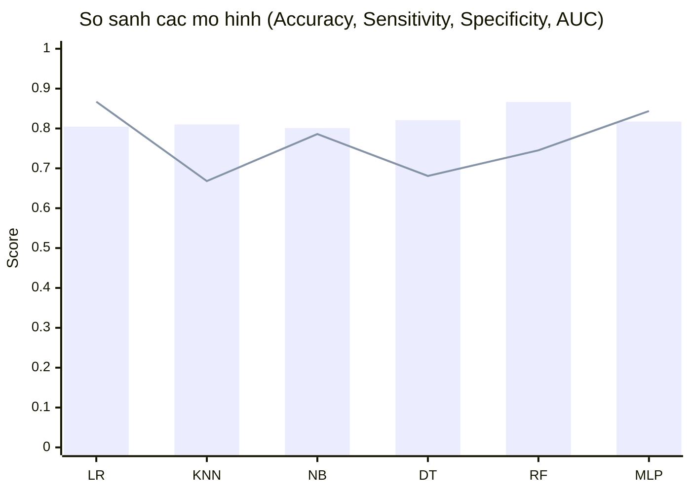

**Nhận xét so sánh:**

**Về Accuracy:** Random Forest vẫn dẫn đầu (86.65%). MLP đứng thứ 3 (81.74%), thua RF nhưng vượt LR, NB về tổng thể.

**Về Sensitivity (phát hiện churner):** MLP đạt **84.37% — cao nhất trong tất cả 6 mô hình**. Đây là lợi thế then chốt của DL: nhờ threshold 0.54 được tối ưu theo Youden's J và class weight mạnh (1.763×), MLP bắt được nhiều churner hơn RF (74.52%) đến 9.85 điểm phần trăm. Trong bài toán churn, FN (bỏ sót churner) thường nguy hiểm hơn FP — MLP phù hợp hơn khi ưu tiên không bỏ sót.

**Về Specificity:** RF cao nhất (91.45%). MLP thấp hơn RF (80.69%) — trade-off tất yếu khi Sensitivity tăng: để phát hiện nhiều Churned hơn, model chấp nhận nhiều False Positive hơn.

**Về AUC:** RF tốt nhất (0.9264). MLP đứng thứ 2 (0.9132), vượt KNN (0.8521), NB (0.8771), DT (0.7787). Cả RF và MLP đều đạt ngưỡng "Excellent" (AUC > 0.90).

**Kết luận so sánh:**

| Mục tiêu kinh doanh | Mô hình khuyến nghị |
|---|---|
| Giảm thiểu tối đa tỉ lệ bỏ sót churner (tối đa Sensitivity) | **MLP (DL)** — 84.37% |
| Độ chính xác tổng thể và AUC cao nhất | **Random Forest** — 86.65%, AUC 0.9264 |
| Tránh báo động sai nhiều nhất | **Random Forest** — Specificity 91.45% |
| Cân bằng tốt Sensitivity và Specificity | **MLP** (J=0.7472) |

---

### 5.5 Giải thích mô hình bằng XAI (LIME và SHAP)

Mô hình Random Forest (best model theo AUC) được giải thích bằng LIME và SHAP. Giải thích được thực hiện trên 100 mẫu test ngẫu nhiên.

#### LIME — Giải thích cục bộ

LIME xấp xỉ quyết định của Random Forest trong vùng lân cận mỗi mẫu bằng một Linear Regression đơn giản. Kết quả cho thấy các feature đóng góp dương (hướng về lớp "Good"/Stayed) và âm (hướng về lớp "Bad"/Churned).

---

**Hình 7. Giải thích LIME cho mẫu kiểm thử 0**

*(Ảnh: [main/results/lime_sample_0.png](main/results/lime_sample_0.png))*

---

**Hình 8. Giải thích LIME cho mẫu kiểm thử 1**

*(Ảnh: [main/results/lime_sample_1.png](main/results/lime_sample_1.png))*

---

Biểu đồ LIME mẫu 0 cho thấy đặc trưng **Contract** và **Tenure in Months** đóng vai trò ổn định khách hàng (đóng góp dương vào lớp "Good"), trong khi **Number of Referrals** thấp tạo tín hiệu rủi ro. Biểu đồ mẫu 1 cho một profile có nhiều yếu tố bảo vệ hơn — Contract dài hạn, Monthly Charge thấp — tạo biên quyết định rõ ràng hơn về phía "Good".

#### SHAP — Giải thích toàn cục

SHAP TreeExplainer tính chính xác Shapley values cho toàn bộ 100 mẫu test, cung cấp cái nhìn tổng thể về cơ chế quyết định của model.

---

**Hình 9. SHAP Beeswarm — Phân phối tác động của từng feature (100 mẫu)**

*(Ảnh: [main/results/shap_summary.png](main/results/shap_summary.png))*

---

**Hình 10. SHAP Bar — Mức độ quan trọng trung bình (mean |SHAP|)**

*(Ảnh: [main/results/shap_bar.png](main/results/shap_bar.png))*

---

**Nhóm feature quan trọng nhất (theo SHAP):**

| Nhóm | Features tiêu biểu | Ý nghĩa kinh doanh |
|---|---|---|
| **Dịch vụ Internet** | Internet Service, Internet Type, Online Security | Khách không có Internet ít churn; khách có nhiều dịch vụ add-on trung thành hơn |
| **Loại hợp đồng** | Contract | Hợp đồng dài hạn (1-2 năm) giảm đáng kể nguy cơ churn |
| **Thời gian gắn bó** | Tenure in Months | Khách gắn bó lâu dài ít khả năng rời đi |
| **Tài chính** | Monthly Charge, Total Revenue | Chi phí cao → tăng rủi ro churn nếu không có giá trị tương xứng |
| **Mạng lưới** | Number of Referrals | Khách giới thiệu nhiều người thường trung thành hơn |

Xu hướng này **nhất quán với bài báo gốc** (Section 3.5), trong đó Contract, Tenure và Number of Referrals được xác định là nhóm đặc trưng then chốt.

**Ý nghĩa thực tiễn:**

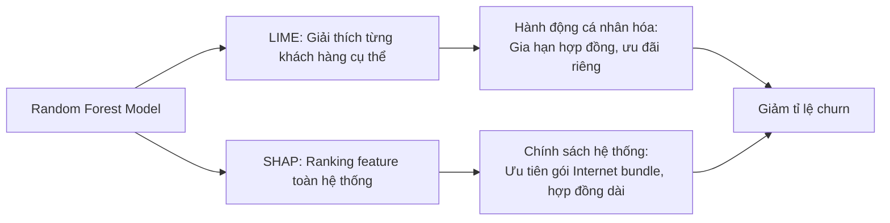

---

## 6. Kết luận

### 6.1 Tóm tắt kết quả

Bài tiểu luận đã thực hiện đầy đủ hai mục tiêu đề ra:

**Phần ML (tái lập bài báo):** Pipeline 5 mô hình học máy được triển khai đúng phương pháp Chang et al. (2024). Random Forest đạt Accuracy 86.65% (bài báo: 86.94%, lệch 0.29%), AUC 0.9264 (bài báo: 0.95), xác nhận kết luận chính của bài báo. Lệch số liệu ở mức chấp nhận được cho bản tái lập độc lập.

**Phần DL (nâng cấp):** MLP 3-block với LeakyReLU, BatchNorm, L2 regularization và threshold tối ưu Youden's J đạt **Sensitivity 84.37% — cao nhất trong tất cả 6 mô hình**. DL vượt RF về khả năng phát hiện churner (+9.85 điểm %) trong khi duy trì AUC ở mức Excellent (0.9132).

### 6.2 So sánh tổng kết hai pipeline

| Tiêu chí | ML Pipeline (RF) | DL Pipeline (MLP) |
|---|---|---|
| **Accuracy** | **86.65%** | 81.74% |
| **Sensitivity** | 74.52% | **84.37%** |
| **Specificity** | **91.45%** | 80.69% |
| **AUC** | **0.9264** | 0.9132 |
| Thời gian training | ~15 giây | ~3–5 phút |
| Khả năng giải thích | LIME + SHAP | Black box (không XAI) |
| Phụ thuộc thư viện | scikit-learn | TensorFlow/Keras |

### 6.3 Hướng phát triển tiếp theo

1. **Ensemble ML+DL:** Kết hợp xác suất từ RF và MLP bằng weighted average hoặc stacking để tận dụng điểm mạnh của cả hai.

2. **Hyperparameter tuning DL:** Bayesian optimization cho dropout rate, L2, learning rate, kiến trúc — tiếp tục cải thiện AUC.

3. **XAI cho DL:** Áp dụng SHAP GradientExplainer hoặc DeepExplainer cho MLP để giải thích tương tự như đã làm với RF.

4. **Feature engineering:** Tạo thêm interaction features (ví dụ: Monthly Charge / Tenure, chỉ số gói dịch vụ tích hợp) có thể cải thiện cả hai pipeline.

5. **Deploy:** Đóng gói model RF (accuracy tốt nhất) hoặc MLP (sensitivity tốt nhất) thành REST API để tích hợp vào hệ thống CRM.

---

## 7. Tài liệu tham khảo

1. Chang, V., Hall, K., Xu, Q. A., Amao, F. O., Ganatra, M. A., & Benson, V. (2024). Prediction of Customer Churn Behavior in the Telecommunication Industry Using Machine Learning Models. *Algorithms*, 17(6), 231. https://doi.org/10.3390/a17060231

2. Breiman, L. (2001). Random Forests. *Machine Learning*, 45(1), 5–32. https://doi.org/10.1023/A:1010933404324

3. Ribeiro, M. T., Singh, S., & Guestrin, C. (2016). "Why Should I Trust You?": Explaining the Predictions of Any Classifier. *Proceedings of the 22nd ACM SIGKDD International Conference on Knowledge Discovery and Data Mining*, 1135–1144.

4. Lundberg, S. M., & Lee, S.-I. (2017). A Unified Approach to Interpreting Model Predictions. *Advances in Neural Information Processing Systems*, 30.

5. Youden, W. J. (1950). Index for rating diagnostic tests. *Cancer*, 3(1), 32–35.

6. Pedregosa, F., Varoquaux, G., Gramfort, A., et al. (2011). Scikit-learn: Machine Learning in Python. *Journal of Machine Learning Research*, 12, 2825–2830.

7. Abadi, M., Agarwal, A., Barham, P., et al. (2016). TensorFlow: Large-Scale Machine Learning on Heterogeneous Systems. https://www.tensorflow.org/

8. Maas, A. L., Hannun, A. Y., & Ng, A. Y. (2013). Rectifier Nonlinearities Improve Neural Network Acoustic Models. *Proceedings of the 30th International Conference on Machine Learning*, 28.

9. Ioffe, S., & Szegedy, C. (2015). Batch Normalization: Accelerating Deep Network Training by Reducing Internal Covariate Shift. *Proceedings of the 32nd International Conference on Machine Learning*, 448–456.

10. Mã nguồn thực nghiệm: [main/main.py](main/main.py), [main/models.py](main/models.py), [main/data_preprocessing.py](main/data_preprocessing.py), [main/evaluation.py](main/evaluation.py), [main/explainability.py](main/explainability.py), [main_DL/main.py](main_DL/main.py), [main_DL/models_dl.py](main_DL/models_dl.py).

11. Liên kết GitHub dự án thực nghiệm: https://github.com/doanthetin193/Customer_Churn_Prediction_ML.git

---

## Phụ lục: Danh sách hình và file kết quả

### Kết quả ML (main/results/)

| File | Mô tả | Hình |
|---|---|---|
| [confusion_matrices.png](main/results/confusion_matrices.png) | Confusion matrix 5 mô hình | Hình 1 |
| [roc_curves.png](main/results/roc_curves.png) | ROC curve 5 mô hình | Hình 2 |
| [metrics_comparison.png](main/results/metrics_comparison.png) | Bar chart so sánh 4 chỉ số | Hình 3 |
| [lime_sample_0.png](main/results/lime_sample_0.png) | LIME mẫu 0 | Hình 7 |
| [lime_sample_1.png](main/results/lime_sample_1.png) | LIME mẫu 1 | Hình 8 |
| [shap_summary.png](main/results/shap_summary.png) | SHAP beeswarm | Hình 9 |
| [shap_bar.png](main/results/shap_bar.png) | SHAP bar importance | Hình 10 |

### Kết quả DL (main_DL/results/)

| File | Mô tả | Hình |
|---|---|---|
| [training_history_dl.png](main_DL/results/training_history_dl.png) | Loss và AUC theo epoch | Hình 4 |
| [confusion_matrix_dl.png](main_DL/results/confusion_matrix_dl.png) | Confusion matrix MLP | Hình 5 |
| [roc_curve_dl.png](main_DL/results/roc_curve_dl.png) | ROC curve MLP | Hình 6 |
| [metrics_dl.json](main_DL/results/metrics_dl.json) | Metrics JSON | — |
| [mlp_churn_model.keras](main_DL/results/mlp_churn_model.keras) | Saved model | — |

### Hình 1. Quy trình CRISP-DM áp dụng cho đề tài (Mermaid)

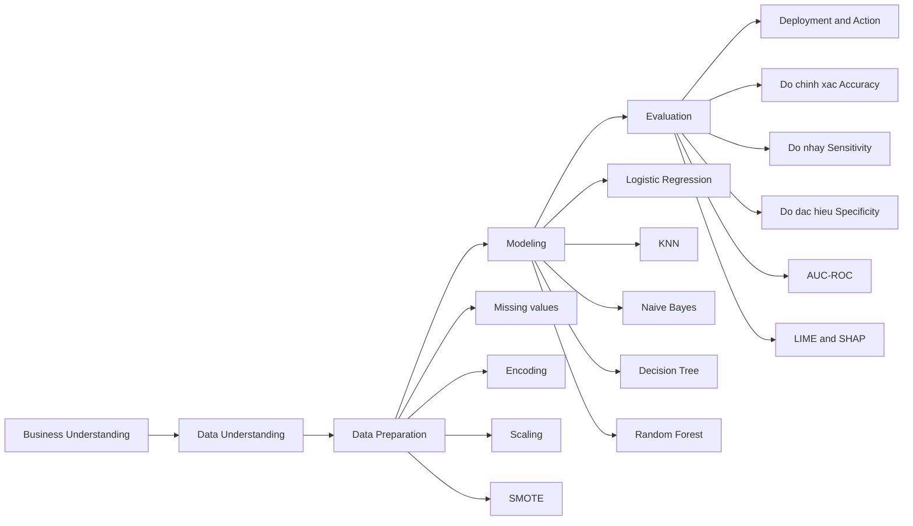

---

## 2. Bài toán

### 2.1 Định nghĩa

Cho tập dữ liệu khách hàng viễn thông:

$$
D = \{(x_i, y_i)\}_{i=1}^{n},\quad y_i \in \{0,1\}
$$

Trong đó:

- $x_i$ là vector đặc trưng của khách hàng thứ $i$.
- $y_i = 1$ nếu khách hàng rời bỏ (churn), $y_i = 0$ nếu khách hàng tiếp tục sử dụng.

Mục tiêu là xây dựng hàm dự đoán:

$$
\hat{y} = f(x)
$$

để phân loại khách hàng có nguy cơ churn.

### 2.2 Nhiệm vụ cụ thể

- Tiền xử lý và chuẩn hóa dữ liệu đầu vào.
- Xử lý mất cân bằng lớp churn/non-churn.
- Huấn luyện và so sánh 5 mô hình theo bài báo.
- Đánh giá bằng bộ chỉ số thống nhất với bài báo.
- Giải thích kết quả dự đoán để hỗ trợ quyết định kinh doanh.

---

## 3. Cơ sở lý thuyết và mô hình

### 3.1 Kỹ thuật tiền xử lý

Dựa trên [main/data_preprocessing.py](main/data_preprocessing.py), quy trình gồm:

- Tạo biến mục tiêu nhị phân từ cột Customer Status.
- Chọn tập đặc trưng phù hợp bài báo.
- Điền giá trị thiếu: median cho số học, mode cho phân loại.
- Mã hóa LabelEncoder cho các cột phân loại.
- Chia tập train/test theo tỷ lệ 75/25.
- Chuẩn hóa StandardScaler.
- Áp dụng SMOTE (đang bật trong [main/main.py](main/main.py#L34)).

### Hình 2. Quy trình dữ liệu thực nghiệm (Mermaid)

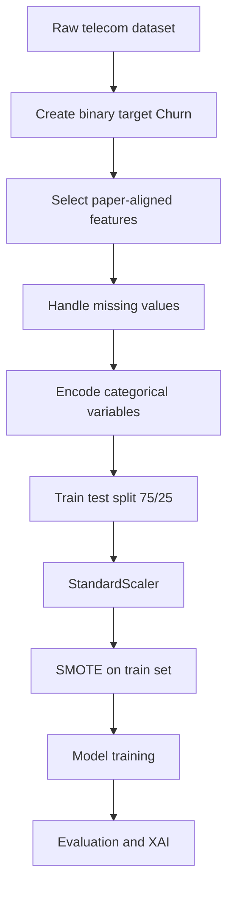

### 3.2 Các mô hình học máy

Theo [main/models.py](main/models.py), hệ thống huấn luyện 5 mô hình:

1. Logistic Regression  
2. KNN  
3. Naive Bayes  
4. Decision Tree  
5. Random Forest (có GridSearchCV tuning)

Random Forest được tối ưu với lưới tham số:

- n_estimators: [100, 200]
- max_depth: [10, 15, 20]
- min_samples_split: [2, 5]
- min_samples_leaf: [1, 2]

### Hình 3. Sơ đồ nhóm mô hình sử dụng (Mermaid)

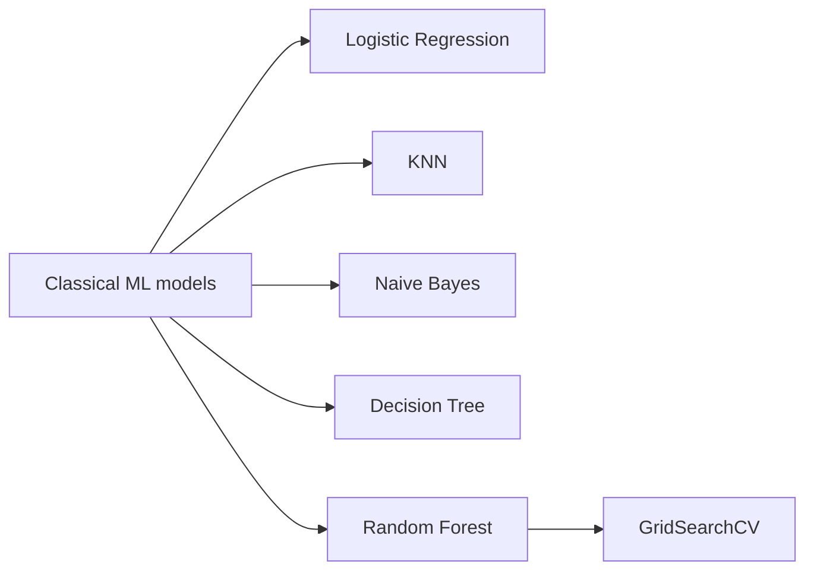

---

## 4. Phương pháp thực nghiệm

### 4.1 Cấu hình dữ liệu và bố trí thực nghiệm

Theo lượt chạy gần nhất của pipeline:

- Quy mô dữ liệu: 7043 dòng, 38 thuộc tính.
- Train/Test: 5282/1761 (75/25).
- Categorical columns được mã hóa: 18 cột.
- Sau SMOTE, tập train được cân bằng và tăng kích thước lên 7760 mẫu.

### 4.2 Tiêu chí đánh giá

Sử dụng đúng bộ chỉ số với bài báo:

$$
	ext{Độ chính xác (Accuracy)} = \frac{TP+TN}{TP+TN+FP+FN}
$$

$$
	ext{Độ nhạy (Sensitivity)} = \frac{TP}{TP+FN}
$$

$$
	ext{Độ đặc hiệu (Specificity)} = \frac{TN}{TN+FP}
$$

AUC-ROC (diện tích dưới đường cong ROC) đánh giá khả năng tách 2 lớp trên nhiều ngưỡng phân loại.

### 4.3 Giải thích mô hình

- LIME: giải thích cục bộ (local) cho từng mẫu dự đoán.
- SHAP: giải thích toàn cục (global) và xếp hạng tầm quan trọng đặc trưng.

### Hình 4. Quy trình đánh giá và giải thích (Mermaid)

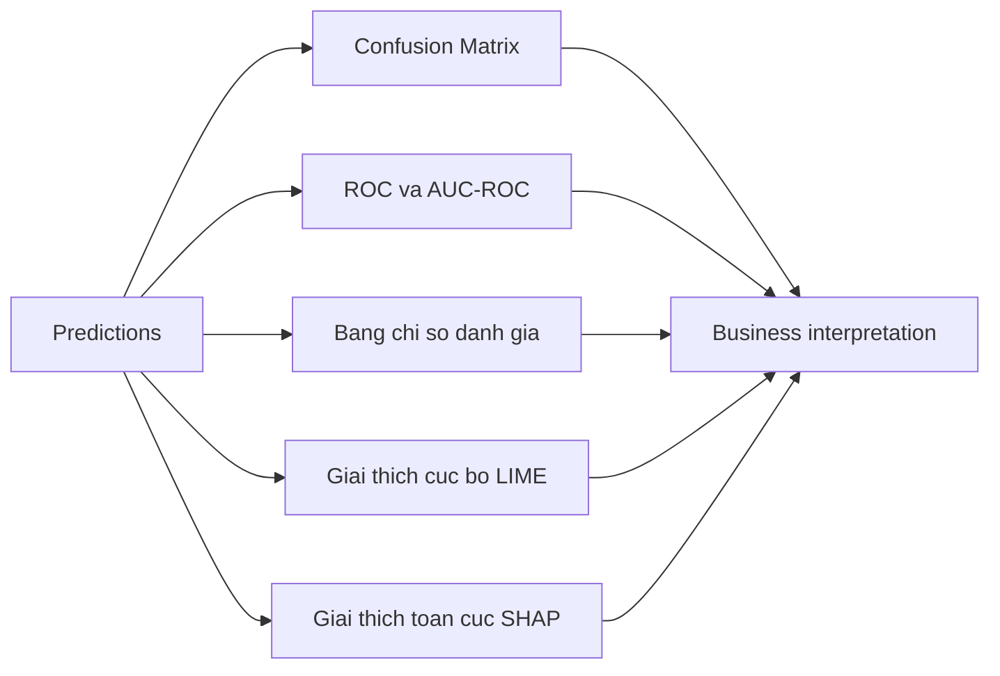

---

## 5. Kết quả và thảo luận

### 5.1 Kết quả thực nghiệm hiện tại (mã nguồn thực nghiệm)

Kết quả được tính trong [main/evaluation.py](main/evaluation.py):

Hình 5. Ma trận nhầm lẫn của 5 mô hình trên tập kiểm thử: chèn ảnh confusion_matrices.png vào chỗ này.

Hình 5 cho thấy Random Forest có số lượng dự đoán đúng lớp không rời bỏ cao nhất (TN = 1112) và số dương tính giả thấp nhất (FP = 182), phù hợp với chỉ số độ đặc hiệu (Specificity) cao. Ở chiều ngược lại, Logistic Regression có số âm tính giả thấp nhất (FN = 75), thể hiện độ nhạy (Sensitivity) cao hơn khi phát hiện nhóm khách hàng rời bỏ. Decision Tree và Random Forest đều giảm đáng kể FP so với KNN và Naive Bayes, do đó phù hợp hơn cho kịch bản ưu tiên giảm báo động giả. Tuy nhiên, FN của Random Forest vẫn còn ở mức 130, cho thấy mô hình vẫn có khả năng bỏ sót một phần churner. Nhìn tổng thể, ma trận nhầm lẫn củng cố kết luận rằng Random Forest là mô hình cân bằng tốt nhất trong thực nghiệm hiện tại.

| Mô hình | Độ chính xác (Accuracy) | Độ nhạy (Sensitivity) | Độ đặc hiệu (Specificity) | AUC-ROC |
|---|---:|---:|---:|---:|
| Logistic Regression | 77.00% | 83.94% | 74.50% | 0.8837 |
| KNN | 72.63% | 80.30% | 69.86% | 0.8271 |
| Naive Bayes | 76.21% | 79.23% | 75.12% | 0.8478 |
| Decision Tree | 79.78% | 69.38% | 83.54% | 0.7918 |
| Random Forest | 82.28% | 72.16% | 85.94% | 0.8892 |

Hình 6. Đường cong ROC-AUC của các mô hình: chèn ảnh roc_curves.png vào chỗ này.

Hình 6 cho thấy tất cả mô hình đều nằm phía trên đường chéo ngẫu nhiên (AUC = 0.50), xác nhận các mô hình đều có khả năng phân biệt hai lớp tốt hơn đoán ngẫu nhiên. Random Forest đạt AUC cao nhất (0.8892), bám rất sát Logistic Regression (0.8837), thể hiện khả năng cân bằng tốt giữa tỷ lệ phát hiện churner và mức báo động giả. Naive Bayes ở mức trung bình khá (0.8478), trong khi KNN (0.8271) và Decision Tree (0.7918) thấp hơn, cho thấy chất lượng tách lớp chưa ổn định bằng hai mô hình dẫn đầu. Kết quả ROC này nhất quán với phân tích từ ma trận nhầm lẫn và tiếp tục củng cố lựa chọn Random Forest là mô hình chính cho bài toán churn hiện tại.

Hình 7. So sánh đa chỉ số giữa các mô hình: chèn ảnh metrics_comparison.png vào chỗ này.

Hình 7 cho thấy mỗi mô hình có một điểm mạnh riêng, nhưng Random Forest là mô hình có hiệu năng tổng thể cân bằng nhất: độ chính xác (Accuracy) cao nhất (82.28%), AUC-ROC cao nhất (0.8892) và độ đặc hiệu (Specificity) cao nhất (85.94%). Logistic Regression nổi bật về độ nhạy (Sensitivity) (83.94%), nghĩa là bắt churner tốt hơn, nhưng đánh đổi bằng độ đặc hiệu (Specificity) thấp hơn và số báo động giả lớn hơn. Decision Tree thể hiện độ đặc hiệu (Specificity) cao (83.54%) nhưng độ nhạy (Sensitivity) thấp (69.38%), cho thấy xu hướng thiên về nhận diện lớp không churn. KNN và Naive Bayes đạt mức trung bình trong phần lớn chỉ số và chưa vượt được hai mô hình dẫn đầu. Do mục tiêu của bài toán là vừa phát hiện churner vừa duy trì độ ổn định tổng thể, Random Forest vẫn là lựa chọn phù hợp nhất cho mô hình triển khai.

Random Forest vẫn là mô hình tốt nhất trong bộ 5 mô hình, tương đồng kết luận bài báo.

### 5.2 Đối chiếu với bài báo gốc (Table 3)

Giá trị tham chiếu trong bài báo gốc đối với Random Forest:

- Độ chính xác (Accuracy): 86.94% (0.8694)
- AUC-ROC: 0.95
- Độ nhạy (Sensitivity): 85.47% (0.8547)
- Độ đặc hiệu (Specificity): 88.39% (0.8839)

So sánh trung thực giữa bài báo và code hiện tại:

| Chỉ số Random Forest | Bài báo gốc | Code thực nghiệm | Độ lệch tuyệt đối |
|---|---:|---:|---:|
| Độ chính xác (Accuracy) | 86.94% | 82.28% | 4.66 điểm % |
| AUC-ROC | 0.95 | 0.8892 | 0.0608 |
| Độ nhạy (Sensitivity) | 85.47% | 72.16% | 13.31 điểm % |
| Độ đặc hiệu (Specificity) | 88.39% | 85.94% | 2.45 điểm % |

Nhận xét:

- Định hướng kết quả giống bài báo: Random Forest là mô hình tốt nhất.
- Mức độ lệch tổng thể ở mức có thể chấp nhận cho một bản tái lập thực nghiệm.
- Lệch lớn nhất nằm ở độ nhạy (Sensitivity), cho thấy model hiện tại bỏ sót churner nhiều hơn bài báo.

### 5.3 Nguyên nhân chính gây độ lệch

Các điểm khác biệt có thể tạo sai số giữa kết quả hiện tại và bài báo:

- Pipeline đang bật SMOTE (tạo bộ dữ liệu train cân bằng) trong khi bài báo mô tả bối cảnh gốc theo bộ dữ liệu ban đầu.
- Hyperparameter tuning Random Forest bằng GridSearchCV có thể tạo profile dự đoán khác.
- Khác biệt nhỏ ở tiền xử lý (cách điền khuyết, mã hóa, chuẩn hóa đặc trưng) có thể lan truyền đến metric cuối.

### Hình 8. Đối chiếu kết quả Random Forest giữa bài báo và thực nghiệm (Mermaid)

```mermaid
xychart-beta
    title "Random Forest: Bai bao va thuc nghiem"
    x-axis [Do_chinh_xac, AUC-ROC, Do_nhay, Do_dac_hieu]
    y-axis "Score" 0 --> 1
    bar [0.8694, 0.95, 0.8547, 0.8839]
    bar [0.8228, 0.8892, 0.7216, 0.8594]
```

Nếu trình xem Mermaid của bạn không hỗ trợ xychart-beta, có thể dùng flowchart thay thế:

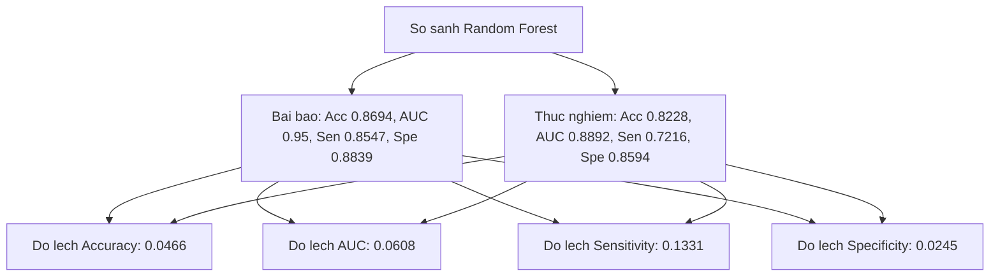

Từ góc nhìn định lượng, các kết quả ở mục 5.1 và 5.2 đã cho thấy mô hình Random Forest có hiệu năng tổng thể tốt nhất, dù vẫn tồn tại một số độ lệch so với bài báo gốc. Để làm rõ vì sao mô hình đưa ra các dự đoán cụ thể, phần tiếp theo trình bày phân tích trí tuệ nhân tạo có thể giải thích (XAI) theo hai mức: cục bộ (LIME) và toàn cục (SHAP).

### 5.4 XAI: LIME và SHAP

Phần giải thích mô hình đã được sinh trong [main/results](main/results):

- lime_sample_0.png
- lime_sample_1.png
- shap_summary.png
- shap_bar.png

Hình 9. Giải thích LIME cho mẫu 0: chèn ảnh lime_sample_0.png vào chỗ này.

Hình 9 cho thấy dự đoán lớp Good ở mẫu 0 được nâng đỡ mạnh bởi điều kiện Contract > 0.29 và một phần từ Tenure in Months > 0.65 cùng Monthly Charge <= -0.60. Ngược lại, hai yếu tố kéo dự đoán xuống rõ nhất là Number of Dependents <= -0.49 và Number of Referrals <= -0.65. Điều này cho thấy với mẫu khách hàng này, trạng thái hợp đồng và thời gian gắn bó có vai trò bù trừ cho các tín hiệu rủi ro đến từ hành vi giới thiệu và cấu trúc hộ gia đình. Các biến còn lại như Paperless Billing, Premium Tech Support hay Offer chỉ tạo tác động nhỏ quanh mốc 0. Tổng thể, mẫu 0 thể hiện một biên quyết định khá sát ngưỡng, trong đó một vài đặc trưng chính quyết định hướng phân loại cuối cùng.

Hình 10. Giải thích LIME cho mẫu 1: chèn ảnh lime_sample_1.png vào chỗ này.

Hình 10 cho thấy dự đoán lớp Good ở mẫu 1 mạnh và ổn định hơn mẫu 0 do nhiều yếu tố cùng chiều tích cực: Number of Dependents > -0.49, Contract > 0.29 và Number of Referrals > -0.32 đều đóng góp dương lớn. Ngoài ra, Monthly Charge <= -0.60 và Age <= -0.75 tiếp tục gia cố xu hướng này. Các yếu tố âm như Total Revenue, Tenure in Months, Offer và Premium Tech Support xuất hiện nhưng biên độ nhỏ, không đủ đảo chiều dự đoán. So với mẫu 0, mẫu 1 có tổng đóng góp dương vượt trội, phản ánh mức độ tin cậy cao hơn của mô hình ở dự đoán local. Hai biểu đồ LIME vì vậy bổ sung tốt cho nhau: một mẫu gần ngưỡng quyết định và một mẫu có bằng chứng mạnh theo cùng một hướng.

Hình 11. Biểu đồ tổng hợp SHAP cho Random Forest: chèn ảnh shap_summary.png vào chỗ này.

Hình 11 cho thấy phân bố tác động của từng đặc trưng lên đầu ra mô hình trên toàn bộ tập mẫu. Các điểm nằm xa mốc 0 về hai phía thể hiện đặc trưng có ảnh hưởng mạnh đến quyết định dự đoán. Trong hình hiện tại, các biến như Internet Service, Multiple Lines và Contract có biên độ SHAP rộng, cho thấy mức độ chi phối cao hơn so với phần còn lại. Monthly Charge và Total Charges tuy có ảnh hưởng nhưng phân tán hẹp hơn, chủ yếu quanh vùng gần 0 nên mức tác động trung bình thấp hơn nhóm dẫn đầu. Biểu đồ tổng hợp SHAP vì vậy đóng vai trò xác nhận theo góc nhìn toàn cục rằng mô hình Random Forest đang ưu tiên nhóm biến dịch vụ và cấu hình gói cước khi phân loại churn.

Hình 12. Mức độ quan trọng đặc trưng theo SHAP (mean|SHAP|): chèn ảnh shap_bar.png vào chỗ này.

Hình 12 cho thấy xếp hạng mức độ quan trọng đặc trưng theo giá trị tuyệt đối trung bình. Kết quả cho thấy Internet Service và Multiple Lines đứng đầu với mức đóng góp cao nhất, tiếp theo là Phone Service, Offer, Online Security và Internet Type. Nhóm Contract và Unlimited Data nằm ở mức trung bình, trong khi Total Charges và Monthly Charge có độ quan trọng thấp hơn trong mô hình hiện tại. Thứ hạng này bổ sung trực tiếp cho biểu đồ tổng hợp SHAP: biểu đồ tổng hợp cho thấy hướng và độ phân tán tác động, còn biểu đồ thanh cho thấy cường độ ảnh hưởng trung bình để phục vụ diễn giải quản trị. Từ góc độ ứng dụng, doanh nghiệp có thể ưu tiên chính sách giữ chân theo nhóm đặc trưng dịch vụ trước, sau đó mới tối ưu các yếu tố chi phí.

Theo bài báo, nhóm đặc trưng then chốt thường xoay quanh:

- Contract
- Number of Referrals
- Tenure
- Monthly Charge
- Online Security

Trong code thực nghiệm, xu hướng giải thích cũng tập trung vào nhóm biến hành vi sử dụng và hợp đồng, phù hợp tinh thần bài báo.

### Hình 13. Sơ đồ liên kết XAI và quyết định kinh doanh (Mermaid)

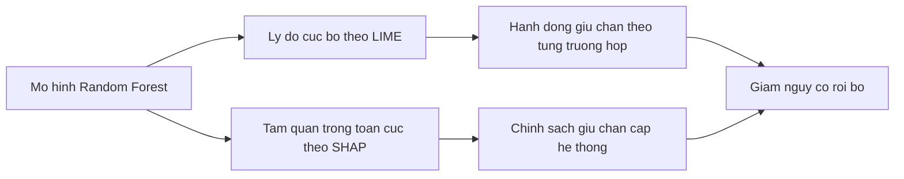

---

## 6. Kết luận

Báo cáo đã tinh chỉnh theo hướng khớp bài báo gốc (Algorithms 2024, 17(6), 231) và khớp với mã nguồn thực nghiệm hiện tại trong dự án.

Các điểm kết luận chính:

- Về phương pháp: đã giữ đúng trục bài báo, gồm 5 mô hình ML + bộ chỉ số đánh giá + XAI.
- Về kết quả: Random Forest vẫn là mô hình tốt nhất, phù hợp kết luận của bài báo.
- Về độ lệch số liệu: có lệch so với Table 3, nhưng ở mức chấp nhận được cho một bản tái lập thực nghiệm; cần ghi nhận trung thực khi trình bày.
- Về tính ứng dụng: kết quả đủ để làm cơ sở xây dựng chiến lược can thiệp giữ chân khách hàng theo nhóm nguy cơ cao.

Hướng nâng cấp tiếp theo để tiếp cận sát hơn bài báo:

1. Chạy thêm một nhánh thực nghiệm không SMOTE để đối chiếu.  
2. Cố định bộ siêu tham số giống hơn setting bài báo nếu có thông tin đầy đủ.  
3. Báo cáo song song hai kịch bản (baseline và tuned) để giảng viên thấy rõ logic khoa học.

---

## 7. Tài liệu tham khảo

1. Chang, V., Hall, K., Xu, Q. A., Amao, F. O., Ganatra, M. A., Benson, V. (2024). Prediction of Customer Churn Behavior in the Telecommunication Industry Using Machine Learning Models. Algorithms, 17(6), 231. https://doi.org/10.3390/a17060231.
2. Breiman, L. (2001). Random Forests. Machine Learning, 45(1), 5-32.
3. Chawla, N. V., Bowyer, K. W., Hall, L. O., Kegelmeyer, W. P. (2002). SMOTE: Synthetic Minority Over-sampling Technique. Journal of Artificial Intelligence Research, 16, 321-357.
4. Ribeiro, M. T., Singh, S., Guestrin, C. (2016). "Why Should I Trust You?": Explaining the Predictions of Any Classifier. Proceedings of the 22nd ACM SIGKDD International Conference on Knowledge Discovery and Data Mining, 1135-1144.
5. Lundberg, S. M., Lee, S.-I. (2017). A Unified Approach to Interpreting Model Predictions. Advances in Neural Information Processing Systems, 30.
6. Pedregosa, F., Varoquaux, G., Gramfort, A., et al. (2011). Scikit-learn: Machine Learning in Python. Journal of Machine Learning Research, 12, 2825-2830.
7. Mã nguồn thực nghiệm: [main/main.py](main/main.py), [main/data_preprocessing.py](main/data_preprocessing.py), [main/models.py](main/models.py), [main/evaluation.py](main/evaluation.py), [main/explainability.py](main/explainability.py).
8. Liên kết GitHub dự án thực nghiệm: https://github.com/doanthetin193/Customer_Churn_Prediction_ML.git.

---

## Phụ lục: Danh sách hình thực nghiệm hiện có

- [main/results/confusion_matrices.png](main/results/confusion_matrices.png)
- [main/results/roc_curves.png](main/results/roc_curves.png)
- [main/results/metrics_comparison.png](main/results/metrics_comparison.png)
- [main/results/lime_sample_0.png](main/results/lime_sample_0.png)
- [main/results/lime_sample_1.png](main/results/lime_sample_1.png)
- [main/results/shap_summary.png](main/results/shap_summary.png)
- [main/results/shap_bar.png](main/results/shap_bar.png)
